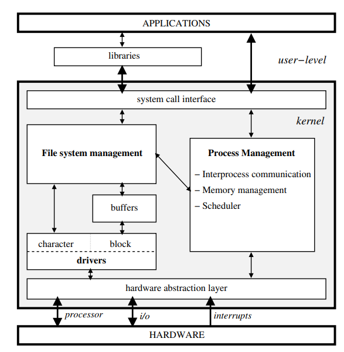
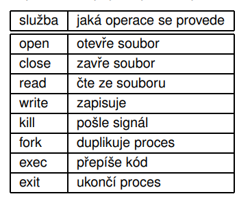
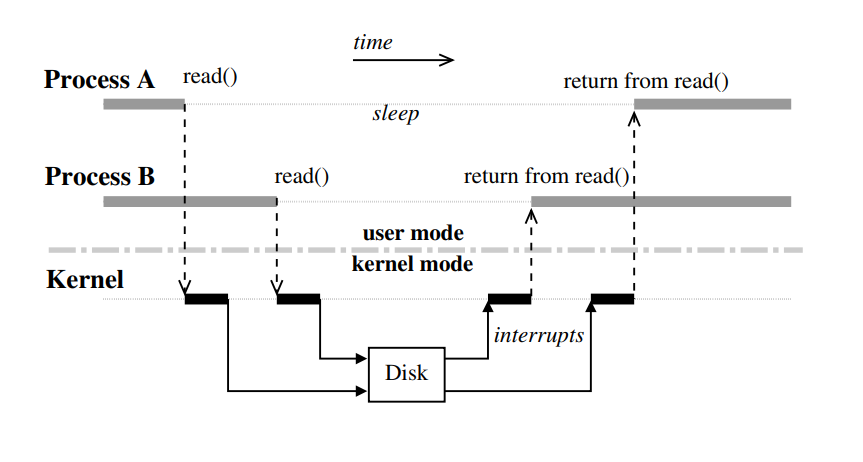

16.2.2022

Unix - úvod, historie (mrdá pes), příčiny úspěchu UNIXu, varianty UNIXu, základní koncepty, struktura jádra, komunikace s jádrem - HW přerušení

Programování v UNIXu, nástroje programátora

## Příčiny úspěchu UNIXu
- víceprocesový, víceuživatelský
- napsán v C - přenositelný
- zpočátku (a později taky) šířen ve zdrojovém tvaru
- jednoduché uživatelské rozhraní (terminál)
- hierarchický systém souborů

## Varianty UNIXu

### Hlavní větve OS UNIXového typu
- UNIX system V (původní, z AT&T)
- BSD UNIX (FreeBSD, NetBSD...)
- Linux

## Základní koncepty
- dvě základní koncepce - procesy a soubory
- procesy mezi sebou komunikují pomocí různých mechanismů meziprocesové komunikace - IPC (roury, signály, semafory, sdílená paměť, sockets, zprávy...)
- pro komnikaci se používá nějaké IO rozhraní (read, write, close...)

## Struktura jádra UNIXu

### Popis
- Na horním okraji jádra (směrem k uživatelům, aplikacím) je vrstva implementující rozhraní volání služeb, prostřednictvím které jádro přebírá žádosti o služby od aplikací. Rozhraní kontroluje, zda ten, kdo o službu žádá, ji může volat, zda jsou parametry validní, a poté rozhraní předává požadavek dál do jádra.
- Aplikace mohou s jádrem komunikovat přímo (ne úplně časté)
- Vrstva abstrakce HW

## Komunikace s jádrem a HW přerušení
- Služby jádra - operace, jejichž realizace je pro procesy zajišťována jádrem. Explicitně je možné o provedení učité služby žádat prostřednictvím systémového volání (system call)

- 

### **Hardwarová přerušení**
- jedná se opravdu o elektrické signály, které jdou napřed do řadice přerušení a poté do procesoru
- je to mechanismus, kterým HW dává asyynchronně najevo jádru vznik událostu, kterou je třeba obsloužit
- přerušení mají stanovené priority
- přerušení také vznikají přímo na procesrou
    - trap - po obsluze pokračuj další instrukcí
    - fault - po obsluze se znovu opaku instrukce, která vyjímku vyvolala
    - abort - dochází k závažným problémům CPU, není jasné jak pokračovat - provedení se ukončí (zanořené vyjímky typu fault, chyby HW detekované CPU)

Přerušení obsluhy přerušení
- je třeba na toto dávat pozor
- nutnost synchronizace obsluhy přerušení tak, aby nedošlo k nekonzistencím ve stavu jádra díky interferenci částečně provedených obslužných rutin
- využívají se metody vyloučení obsluhy přerušení

#### Speciální typy přerušení
- tato přerušení obsluhuje procesor zcela specifický zůsobem, často mimo vliv jádra
- Interprocessor interrupt (IPI): meziprocesrórové přerušení
    - používá se pro přeposílání přerušení z jednoho CPU na druhý nebo pro správu CACHE
System management Interrupt (SMI) - přerušení vyvolává správa systému
    - může být vyvoláno HW i SW ve zvláštních situacích

#### **Zakázání přerušení**
- na procesoru
- čistě programově v jádře (přerušení se přijme, ale pouze se zaznamená že vzniklo a dál se neřeší)

*NMI* - non-maskable interrupt - HW přerušení, které nelze zamaskovat (zakázat) na řediči, ani zakázat jeho příjem na procesoru (používá se typicky pro chyby bez možnosti zotavení: chyby paměti, sběrnice..., někdy taky pro ladění či řešení uváznnutí v jádře, tzv. "NMI watchdog")

- je třeba dávat pozor, viz předchozí sekce na to, že při zakazování přerušení se:
    - zvyšuje latence systému
    - může dojít ke ztrátě přerušení
    - systém se může dostat do nekonzistentního stavu (zpoždění času, ztráta přehledu o situaci vně jádra, neprovedení některých akcí v HW, přetečení vyrovnávacích pamětí...)
    - pro toto se právě využívají ty priority nebo rozdělení obsluhy do více částí

### **Úrovně obsluhy přerušení**
- často dvě úrovně
1. úroveň
    - má být co nejkratší
    - zajišťuje minimální obsluhu HW (přesun dat z/do bufferu, vydání příkazů k další činnosti HW) a plánuje běh obsluhy 2. úrovně
    - nelze použít běžné synchronizační prostředky
2. úroveň
    - dokončuje obsluhu přerušení
    - provásí se operace, kdy není potřeba komunikovat s HW
    - nemusí se zakazovat přerušení
    - může běžet v speciálních procesech
    mohou zde být samostatné úrovně priorit

### **Přerušení a ovladače zařízení**
- při inicializaci ovladače, nebo jeho prvním použití, se musí registrovat k obsluze určitého IRQ
- buď u některých zařízení se používají (historicky) zafixovaná čísla přerušení
- nebo ovladač může zjistit číslo přerušení tak, že zakombinuje s ředičem sběrnic; pokud to nefunguje, tak ovladač vydá přikaz zařízení, které má ovládat, aby začalo vysílat nějaká přerušení
- poté se zaregistruje k obsluze příslušného přerušení a HW se přes tabulku přerušení ovladač "dostane ke slovu"
- více zařízení však může používat stejné číslo žádosti o přrerušení
    - v takovém případe jádro vytvoří zřetezený seznam ovladačů, které mají zájem o dané přerušení
    - ovladače musí být napsané tak, že pokud jim dojde přerušení, o které mají zájem, musí zakomunikovat s tím zařízením a zeptat se ho, zda opravdu to zařízení poslalo dané přerušení
    - pokud ano, obslouží se, pokud ne, předá se řízení přerušení dalšímu ovladači v seznamu

## Příklad komunikace s jádrem
- synchronní: proces - jádro
- asynchronní: hardware - jádro

