9.3.2022, 16.3.2022, 

# Správa souborů

## Disky

### Pevný disk
- skládá se z ploten, na nich jsou stopy (soustředné kružnice) a ty se dělí na sektory
- diskový sektor: nejmenší jednotka, kterou disk umožňuje načíst/zapsat
- velikost sektoru: dříve 512B, nyní 4096B

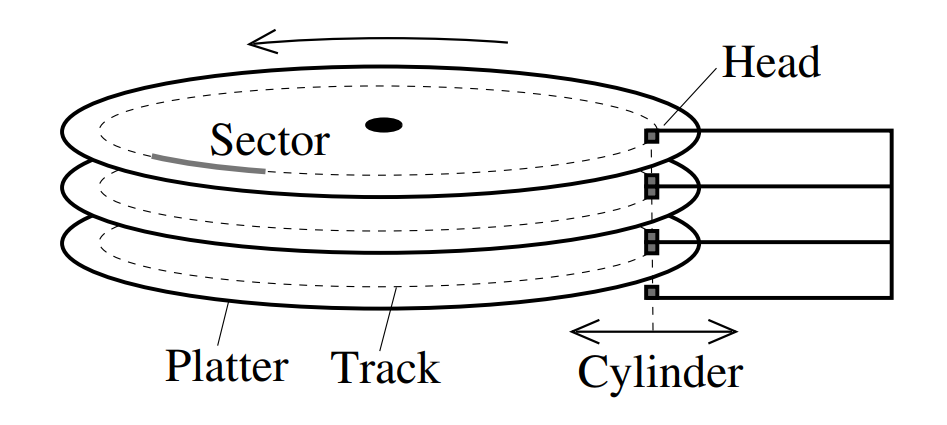

Adresace
- CHS - cylinder, head (typicky 1-6 hlav), sector
- LBA - linear block adress (číslo 0...N)

Připojení
- sběrnice, např. SATA, ATA, USB, FireWire...
- sběrnice se liší:
    - rychlostí (SATA do 6Gbit/s, SAS 22.5 Gbit/s)
    - počtem připojitelných zařízení (SATA desítky, SAS 65 535)
    - max. délkou kabelů (1-2m SATA, 10m SAS)
    - seznamem podporovaných příkazů

Hierarchie paměti
- primární paměť - RAM (nad ní ještě registry)
- sekundární paměť - pevné disky, SSD
- terciální paměť - pásky, CD, DVD, BlueRay...

#### **Parametry pevných disků**
- přístupová doba - doba vystavení hlav + rotační zpoždění
- typické parametry současných disků:
    - kapacita: do 20 TB
    - průměrná doba přístupu: od nízkých jednotek ms
    - otáčky: 4200-15000/min
    - přenosová rychlost: desítky až cca 500MB/s
- dávat pozor na rozdíl GB a GiB
- u přenosových rychlostí zase pozor na *sustained transfer rate* (dlouhodobá rychlost) a *maximum transfer rate* (krátkodobě, z bufferu disku)

### SSD - Solid State Drive
- založeno na NAND flash, ale vyskytují se i řešení založená na DRAM
- Výhody:
    - rychlost
    - náhodný přístup
    - větší přenosové rychlosti (stovky MB/s)
    - pomalejší čtení (pro zápis se musí načíst celý blok, přepsat a zapsat celý blok zpátky)
    - tichý provoz
    - mechanická a magnetická pozornost
    - obvykle nižší spotřeba (neplatí pro DRAM)
- Nevýhody:
    - vyšší cena za jednotku prostoru
    - omezený počet přepisů (nevýznamné pro běžný provoz)
    - mětší riziko katastrofického selhání, nevhodné pro dlouhodobé uložení dat
    - možné komplikace se zabezpečením (např. bezpečné mazání/šifrování přepisem, protože disk může sám od sebe přesouvat data po disku -> bezpečné mazání vyžaduje speciální SW)
- Řešení problému přepisu u SSD
    - disk přesouvá stránky z bloku do bloku (např. máme skoro prázdný blok, tak přesuneme zbytek někam jinam do plnějšího bloku a prázdný blok reinicializujeme a používáme znovu) - tohle je ten bezpečnostní problém
    - TRIM (příkaz, kterým se říká že blok je nepoužívaný a může se přemazat) nelze použít vždy

### Zabezpečení disků
- ECC - Error Correction Code: k uloženým datům sektoru se ukládají redundantní data, nebo alespoň detekci chyb (např. kontrolním součtem)
- S.M.A.R.T - disky si autamaticky shromažďují řadu statistik, které lze použít k předpovídání/diagnostice chyb
- disk rozpoznává a označuje vadné bloky, které poté už nepoužívá
- vadné bloky může kontrolovat i OS

## Disková pole (RAID)

- v praxi se používají hlavně RAID 0, RAID 1 a RAID 5 a RAID 6

RAID 0

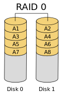

- disk stripping
- následující bloky dat jsou rozděleny na více disků, vyšší výkonnost, žádná redundance, vyšší riziko selhání

RAID 1

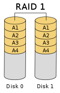

- disk mirroring, všechna data jsou ukládána na dva disky, velká redundance, pomalenší zápis, rychlejší čtení

RAID 2
- nepoužívá se příliš v praxi
- nejsložitější z diskových polí
- data se rozdělují mezi disky po bitech, použito zabezpečení Hammingovým kódem, ten je uložen na speciálním disku
- jako jediný dokáže automaticky detekovat a opravit chybu na jednom disku a detekovat chybu na dvou discích

RAID 3
- data jsou uložna po bajtech na různých discích, navíc je užit disk s paritami

RAID 4
- bloky (sektory či jejich násobky) dat jsou uloženy na různých discích a paritní bloky na zvláštním disku (tento je náchylný na selhání)

RAID 5

- jako RAID 4, ale paritní a datové bloky jsou rozloženy po všech discích, redukce kolizí u paritního disku při zápisu

RAID 6

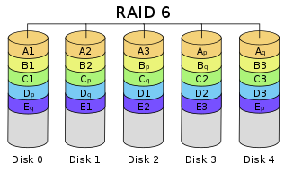

- stejně jako RAID 5, ale parita je uložena 2x -> vyrovná se i se ztrátou 2 disků

## Uložení souboru na disku
- Alokační blok - skupina *pevného počtu sektorů*, *následujících logicky* (v souboru) i *fyzicky (na disku) za sebou*, která je *nejmenší jednotkou diskového prostoru*, kterou OS *čte i zapisuje* při běžných operacích (tohle znát jako básničku)
    - tzn. je to nejmenší část paměti, u které je možné říct, že je spojen za sebou logicky i fyzicky

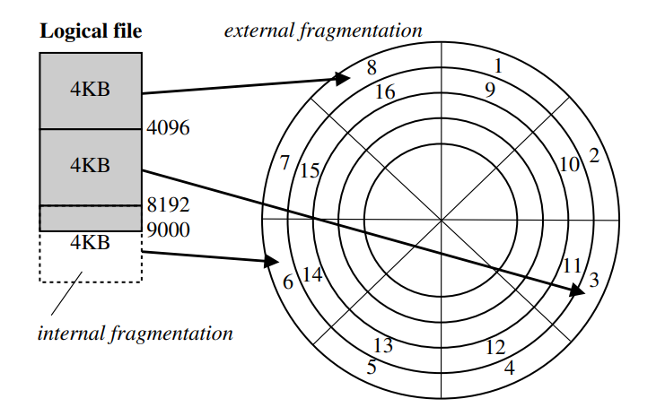

- někdy se tomu říká cluster

## Fragmentace
- dochází k ní při přidělování a uvolňování prostoru pro soubory - externí fragmentace

Negativní dopady

1. Vzniknou nevyužité oblasti diskového prostoru, které se nedají využít buď v daný moment, nebo už nikdy (aniž by se mazalo, nebo přesouval obsah) 
    - v daném okamžiku: mám na disku 50 a 50 MB místa, ale neuložím tam např soubor 100MB, který musí být uložen spojitě i když prostor tam je
    - vůbec - když vznikne menší prostor než je velikost nejmenší adresovatelné jednotky na disku

2. Při nespojitém přidělování prostoru po dostatečně velkých alokačních blocích výše uvedený problém nevzniká, ale data/metadata souboru jsou na disku uložena nespojitě - složitější a pomalejší přístup

### Techniky k minimalizaci externí fragmentace
- rozložení souborů po disku - soubory se neukládají bezprostředně za sebe, je-li to možné
- prealokace - alokuje se více místa, než je momentálně zapotřebí
- odložená alokace - odkládá zápis, než se nabírá více požadavků a je lepší povědomí, kolik je třeba alokovat

Přesto bývají k dispozici nástroje pro defragmentaci

#### **Interní fragmentace**
- nevyužité místo v posledním přiděleném alokačním bloku - plýtvání místem
- některé souborové systéme proto umožňují sdílení posledních alokačních bloků více soubory

## Přístup na disk
- přistupuje se pomocí I/O portů a I/O operací
- načítání dat probíhá přes vyrovnávací paměť disku

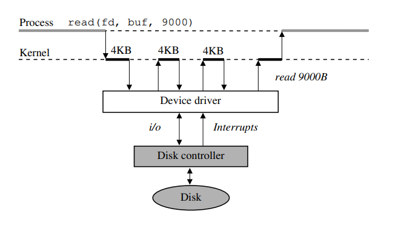

### Plánování přístupu na disk
- součástí jádra je subsystém nazývaný plánovač diskových operací
- shromažďuje požadavky od FS /načtení, zapsání dat z/na disk)
- požadavky ukládá do front, požadavky případně přeuspořádá a předává dál disku ke zpracování
- snaží se minimalizovat režii disku
- používá strategii tzv. výtahového algoritmu (SCAN algorithm)
    - snaha, ay hlavička zbytečně nejezdila sem a tam
- plánovač to samo v bledě modrém dělá i pro SSD
    - sbírá data až jich je dostatek pro jeden blok
    - snaha vyvažovat požadavky jdoucí od jednotlivých uživatelů (procesů)
    - implementace priorit
    - ...

## Logický disk
- dělení fyzického disku na logické disky - diskové oblasti

### Způsob uložení informací o diskových oblastech na disku
- MBR - v prvním (nultém) sektoru byla tabulka s rozdělením na 1-4 primární oddíly
    - 4 díl mohl být nahrazen rozšířenou diskovou oblastí, která mohla být nadále rozdělena na podoblasti zvané logické diskové oblasti, každá z nich mohla být popsána formou zřetězeného seznamu
- GUID - vynechaný prostor pro MBR (kompatibilita), disk se může napřímo rozdělit až na 128 oblastí s použitím kryptografie pro identifikaci
- LVM - Logical Volume Manager - správce logických oblstí
    - umožňuje pokročilejší tvorbu logických disků
    - používá se hlavně když mám více fyzických disků

### Formátování
- disk používá nějaký daný souborový systém, občas je nutné si nově koupený disk zformátovat pro použití
- NTFS, ext3, ext4...

### Žurnálování
- slouží pro záznam modifikovaných metadat před jejich zápisem na disk
- obvykle se implemetuje jako cyklicky přepisovaný buffer ve speciální oblasti disku
- operace, které jsou pokryté žurnálováním jsou tzv. atomické (buď se provedou celé, nebo vůbec když to nejde)
- systémy se žurnálem: ext3, ext4, NTFS, JFS...
- vetšinou se nežurnáluje samotný obsah dat (příliš velký obsah)
- umožňuje spolehlivější a rychlejší návrat do konzistentního stavu po chybách
- kompromis mezi žurnálováním a nežurnálováním dat představuje *předřazení zápisu dat před zápis metadat do žurnálu* - zajistí konzistenci tím, že zapsaná data se před zápisem metadat nebudou uvažovat a znovu se přepíší jakmile bude tem rpostor potřeba

#### **Implementace žurnálování**
- implementace na základě dokončení transakcí (REDO), např. ext3/4
    - sekvencedílčích operací se uloží nejprve do žurnálu mezi značky označující začátek a konec transakce, typicky spolu s kontrolním součtem
    - poté se dílčí operace provádí na disku
    - uspějí-li dílčí operace, transakce se ze žurnálu uvolní
    - při selhání se dokončí všechny transakce, které jsou v žurnálu zapsány celé (s korektním kontrolním součtem)
- implementace na základě anulace transakcí (UNDO)
    - záznam dílčích operací do žurnálu a na disk se prokládá
    - proběhne-li celá transakce, ze žurnálu se uvolní
    - při chybě se eliminují nedokončené operace
- UNDO a REDO je možno kombinovat (NTFS)
- implementace žurnálování musí zajišťovat správné pořadízápisu operací

### Alternativy k žurnálování

Copy-on-write
- technika, která se snaží po celou dobu běhu systému udržovat konzistentní stav
- nejprve se nová data či metadata zapíší a až poté se zpřístupní
- změny se prování hierarchicky od listů až po kořen
- na nejvyšší úrovni se udržuje několik verzí kořenového záznamu se zabezpečovacím kódem a časovými razítky
- po chybě bere systém kořen s nejnovějším časovým razítkem a správným kontrolním součtem

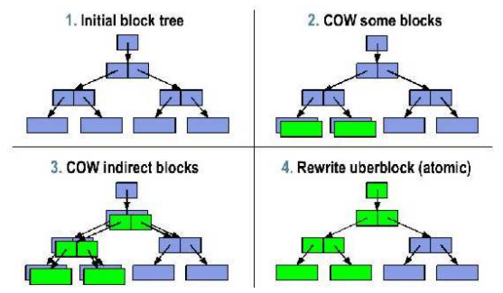

- umožňuje snímky (zálohy) souborového sytému - uložení stavu s možností pozdějšího návratu (stačí zálohovat starší verze kořene)
- umožňuje klonování souborového systému - vytvoření kopií, které jsou v budoucnu samostatně manipulovány - vzniká několik kopií kořene, které se pak dělí samostatně (např pro virtuální stroje se to hodí)

**Další alternativy**
- Soft Updates - používá se v UFS (FreeBSD)
    - snaží se analyzovat a sledovat situace a závislosti tak, aby nikdy nenastala nekonzitence
    - uzpůsobuje se tomu pořadí zápisu dat a metadat na disk
- Log-structured file systems - prakticky log všeho o se kdy na disku stalo, v případě chyby se načte poslední verze, přes tu je přístupný poslední stav disku

### Typy souborových systémů
- fs (nejstarší, UNIX)
- ufs, ufs2 - evoluce fs
- ext2, ext3, ext4 - inspirováno zaké z fs
- FAT, FAT32, VFAT, ExFAT - Microsoft, ExFAT je dobrej pro externí disky, protože ho umí většina OS
- NTFS - Microsoft
- .........
- virtuální souborový systém (VFS) - vrstva, která zastřešuje všechny použité souborové systémy a umožňuje pracovat s nimi jednotným způsobem
    - stačí teda zajistit, aby jakýkoli souborový systém komunikoval s VFS

## Klasický UNIXový systém souborů (FS)
- boot blok - pro zavedení systému při startu
- super blok - informace o souborovém systému (typ, velikost, počet i-uzlů, volné místo, volné i-uzly, kořenový adresář, UUID...)
- tabulka i-uzlů - tabulka s popisy souborů
- datové bloky - data souborů a bloky pro nepřímé odkazy

### Modifikace základního rozložení FS
- datové bloky byly rozděleny do skupin
- zaždá skupina měla svoje i-uzly
- důvodem měla být lepší lokalita, prostorová blízkost dat a meradat
- poté tedy ta struktura vypadala takto: boot blok, super blok, úsek i-uzlu, úsek dat, úsek i-uzlu, úsek dat...

### I-uzel
- základní datová struktura, která popisuje každý soubor v UNIXových systémech
- obsahuje metadata souboru, ve speciálních případech i odkaz (např. symbolický odkaz)
- u FS, ext2, ext3 (více modifikováno na ext4...)
    - stav i-uzlu (alokovaný, volný...)
    - typ souboru
    - délka souboru v bajtech
    - mtime - čas poslední modifikace dat
    - atime - čas posledního přístupu
    - ctime - čas poslední modifikace i-uzlu
    - UID - indetifikace vlastníka (číslo)
    - GID - identifikace skupiny (číslo)
    - přístupová práva
    - počet pevných odkazů (jmen)
    - i další věci, v rozšířených variantách
- ne všechny soubory kompatibilní s UNIX-like systémy musí mít i-uzly

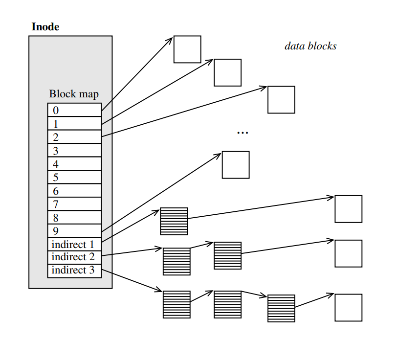

- vzniká stromová struktura - vytváří maximální velikost souboru, který se dá na daném systémovém souboru použít

- Teoretický limit velikosti souboru

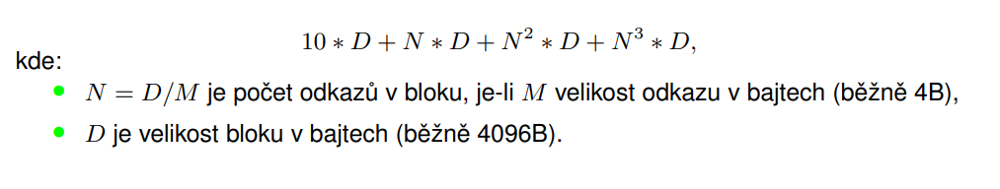

- velikost souboru je dále omezena dalšími strukturami FS, VFS, rozhraním jádra, architekturou systému (32b, 64b)

### Výhody a nevýhody FS
- je navržena s ohledem na minimalizaci režie
    - hlavně průchod souborem, změna velikosti souborů, náhodný přesun souboru
- snadnost vyhledání adresy prvního bloku
- nalezení určité pozice
- přidávání či ubírání bloků
- FS funguje převážně u malých souborů (historie)
- existuje optimalizace pro zvlášť malé soubory (symbolické odkazy) - v i-uzlu bude (pokud možno) uloženo příme jméno souboru

## Jiné způsoby organizace souborů

### Kontinuální uložení
- jedna spojitá posloupnost na disku
- jednoduché nalezení počátku, nebo určitého bloku
- problémy se zvětšováním souborů díky externí fragmentaci

### Zřetězené seznamy bloků
- každý datový blok obsahuje krom dat také odkaz na další blok (nebo příznak konce souboru)
- pro přístup k náhodným blokům je potřeba projít celý soubor
- chyba kdekoli na disku může způsobit velkou ztrátu dat
- problém při změně velikosti (pokud není uložen i odkaz na konec, tak je nutné projít celý soubor)
    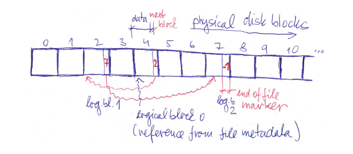

### FAT (File Allocation Table)
- seznamy uložené ve speciální části disku
- na začátku disku je tabulka FAT, která má každou položku pro každý blok
- do této tabulky vedou odkazy z adresářů
- bloky se mohou řetězit
- opět vznikají problémy s náhodným přístupem, ale lepší protože tabulka je v metadatech
- tabulka může být zdvojená, takže není problém ji uložit vícekrát pro vyšší spolehlivost
    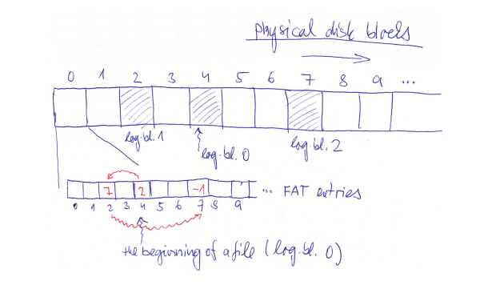

### B+ stromy
- datová struktura převzatá z databází
- dva typy uzlů
- Vnitřní uzly - obsahují sekvenci *link0, key0, link1, key1...*
    - je to kořen, jeho následníci (kromě listových) obsahují odkaz na následníka a vyhledávací klíč
    - klíče jsou jen čísla bloků
    - link (odkazy) - odkazy na nižší části bloků, případně odkazy přímo na data
- Listové uzly - mají podobnou strukturu jako vnitřní uzly
    - odkazy na jajich úrovni vedou přímo na data
    - na listové úrovni jsou bloky zřetězené do jednoho seznamu

#### **Vyhledávání v B+ stromu**
- při hledání klíče *k* se podívám, zda je klíč menší jak klíč *k0*, pokud ano tak jdu níž, pokud ne tak zjistím jestli je mezi *k0* a *k1*, pokud ano, jdu druhým směrem, takto opakuji až po *kn*
- pokud jsem níž opakuji to samé co výš, dokud nedojdu k lisotvým uzlům
- zde hledaný klíč najdu nebo zjistím, že v této struktuře není
    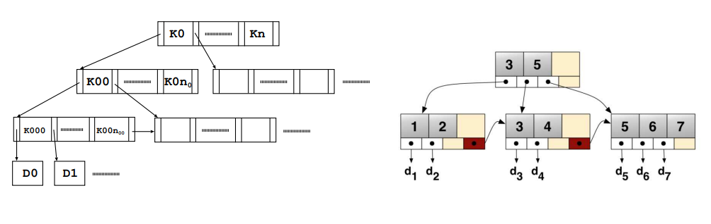

#### **Práce s B+ stromy**
- strom zůstává výškově vyvážený - všechny cesty od kořene k listům mají stejnou délku
- jsou zde limity, jak moc/málo mají být uzly zaplněné - pro uzly s m odkazy máme klíče 0, 1...m - 2 klíčů (odkazů je o 1 méně jak klíčů + číslování od 0)
- pokud je strom tvořen jediným kořenem - nejméně může mít jeden odkaz, max. *m-1* odkazů (poslední odkaz je použit jako ukončovač seznamu listů, protože v tomto případě je kořen také list)
- pokud to není jediný kořen, tak má nějaké následníky, minimálně jich má 2, maximálně *m*
- vložení:
    - děje se na listové úrovni, tzn. projdeme strom od kořene k listům
    - najedem, kam chceme vložit
    - podíváme se, zda má list volný odkaz
    - pokud ano, použijeme ho, pokud ne, list se rozštěpí na dvě poloviny a podívám se o úroveň výš, zda je možné namísto 1 listu linkovat dva listy
    - pokud ano, přidá se odkaz, pokud ne, nadřazený uzel se musí rezštěpit a postupovat o úroveň výš
    - štěpí se tak dlouho, až se případně roštěpí kořen a strom bude mít dva kořeny, které navážu na nový hlavní kořen
- rušení:
    - zase funguje od listů, zruší se odkaz v listu
    - zkontroluje se, zda je uzel zaplněný v rámci daných limitů
    - pokud nao, good, pokud ne podívám se na sousední uzly a pokusím se provést přerozdělení tak, aby byly všechny uzly naplněny v rámci limitů
    - pokud se to nepodaří, tak dojde ke sloučení listů
    - posunu se o úroveň výš, zruším jeden odkaz a repete
    - přinejhorším se může stát, že se zruší i kořen

- B+ stromy a jejich různé varianty jsou použity pro popis diskového prostoru přiděleného souborům v různých souborových systémech
    - XFS, JFS, ReFS, APFS, Btrfs
    - ve zdegenerované podobě i u NTFS a ext4

- určitě se hodí si vyzkoušet simulaci B+ stromu ze stránek IOSu

#### **Extent**
- proměnná jednotka diskového prostoru (ale min. 1 alokační blok); sektor -> alokační blok -> extent
- posloupnost proměnného počtu bloků jdoucích za sebou logicky v souboru a uložených i fyzicky na disku za sebou
- zrychluje se práce s velkými soubory, menší objem metadat, které je třeba procházet a udržovat, lepší lokalita dat a metadat
- přináší lépe vyvážené indexové struktury
- umožňuje nám říct "Tady mám začátek bloky, je spojitý a obsahuje jich tolik a tolik" na rozdíl od hromady odkazů na po sobě jdoucí bloky, které bychom museli uchovávat
- snadno se dopňují do B+ stromů, ale nedá se kombinovat s UNIXovými stromy
- nehodí se používat pro malé soubory v B+ stromů

### ext4 - strom extentů
- analogie B+ stromu bez vyvažování a bez zřetězení listů
- omezený počet úrovní na mx. 5
- kořen v i-uzlu má max 4 odkazy
    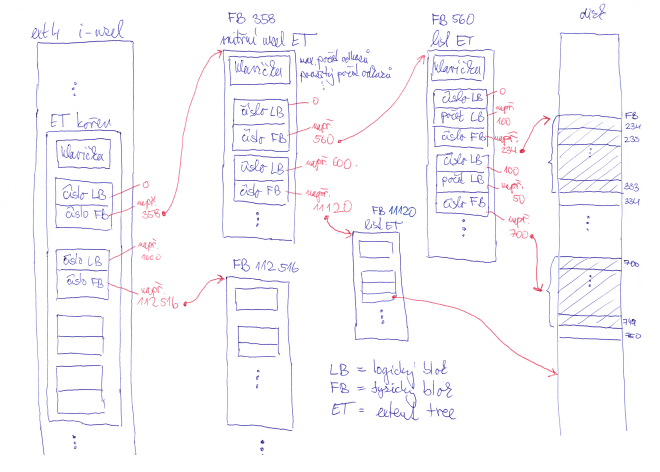

- malé soubory - až 4 extenty odkazované přímo z kořenového uzlu extentového stromu umístěného v i-uzlu, příp. data přímo v i-uzlu (symbolické odkazy)
- při přeplnění i-uzlu se vytvoří nový, plnohodnotný indexový uzel, do něj se přesunou odkazy, v kořeni zůstane jeden. Časem se může zaplnit atd...

### NTFS
- MFT - Master File Table - každý soubor má alespoň jeden řádek, samotná je uložená na disku (MFT obsahuje MFT)
- oproti i-uzlu se na řádku nachází i jméno souboru
- pokud jsou data dostatečně malá, tak jsou rovnou na řádku
- pokud nejsou, tak dávám extent na disk
    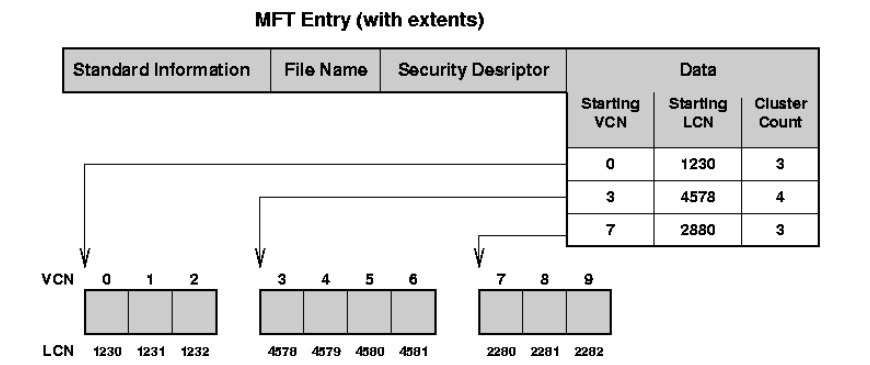

- LCN = fyzický blok, VCN - logický blok

### Organizace volného prostoru
- používá se bitová mapa s jedním bitem pro každý blok (případně rozdělená na několik částí, pokud je disk rozdělen na několik skupin bloků)
    - umožňuje zrychlit vyhledávání volné souvislé části pomocí bitového maskování
- další organizace volného prostoru:
    - seznam - zřetězení volných bloků
    - označení (zřetězení) volných položek v tabulce bloků (FAT)
    - B+ strom - adresace velikostí nebo offsetem
- volný prostor může být organizován také po extentech

### Deduplikace
- snaka odhalit opakované ukládání totožných dat, uložit je jenou a odkazovat se na ně vácenásobně
- podporováno na více úrovních - sekvence bytů, bloky, extenty, soubory
- založeno na kryptografickém hashování
- může se implementovat při zápisu nebo dodatečně (na přání)
- spoří diskový i paměťový prostor
- při menším objemu duplikace může naopak zvyšit spotřebu procesorového času, paměťového i diskového souboru

## Soubory v UNIXu (více uživatelsky)