9.3.2022, 16.3.2022, 23.3.2022

# Správa souborů

## Disky

### Pevný disk
- skládá se z ploten, na nich jsou stopy (soustředné kružnice) a ty se dělí na sektory
- diskový sektor: nejmenší jednotka, kterou disk umožňuje načíst/zapsat
- velikost sektoru: dříve 512B, nyní 4096B

Adresace
- CHS - cylinder, head (typicky 1-6 hlav), sector
- LBA - linear block adress (číslo 0...N)

Připojení
- sběrnice, např. SATA, ATA, USB, FireWire...
- sběrnice se liší:
    - rychlostí (SATA do 6Gbit/s, SAS 22.5 Gbit/s)
    - počtem připojitelných zařízení (SATA desítky, SAS 65 535)
    - max. délkou kabelů (1-2m SATA, 10m SAS)
    - seznamem podporovaných příkazů

Hierarchie paměti
- primární paměť - RAM (nad ní ještě registry)
- sekundární paměť - pevné disky, SSD
- terciální paměť - pásky, CD, DVD, BlueRay...

#### **Parametry pevných disků**
- přístupová doba - doba vystavení hlav + rotační zpoždění
- typické parametry současných disků:
    - kapacita: do 20 TB
    - průměrná doba přístupu: od nízkých jednotek ms
    - otáčky: 4200-15000/min
    - přenosová rychlost: desítky až cca 500MB/s
- dávat pozor na rozdíl GB a GiB
- u přenosových rychlostí zase pozor na *sustained transfer rate* (dlouhodobá rychlost) a *maximum transfer rate* (krátkodobě, z bufferu disku)

### SSD - Solid State Drive
- založeno na NAND flash, ale vyskytují se i řešení založená na DRAM
- Výhody:
    - rychlost
    - náhodný přístup
    - větší přenosové rychlosti (stovky MB/s)
    - pomalejší čtení (pro zápis se musí načíst celý blok, přepsat a zapsat celý blok zpátky)
    - tichý provoz
    - mechanická a magnetická pozornost
    - obvykle nižší spotřeba (neplatí pro DRAM)
- Nevýhody:
    - vyšší cena za jednotku prostoru
    - omezený počet přepisů (nevýznamné pro běžný provoz)
    - mětší riziko katastrofického selhání, nevhodné pro dlouhodobé uložení dat
    - možné komplikace se zabezpečením (např. bezpečné mazání/šifrování přepisem, protože disk může sám od sebe přesouvat data po disku -> bezpečné mazání vyžaduje speciální SW)
- Řešení problému přepisu u SSD
    - disk přesouvá stránky z bloku do bloku (např. máme skoro prázdný blok, tak přesuneme zbytek někam jinam do plnějšího bloku a prázdný blok reinicializujeme a používáme znovu) - tohle je ten bezpečnostní problém
    - TRIM (příkaz, kterým se říká že blok je nepoužívaný a může se přemazat) nelze použít vždy

### Zabezpečení disků
- ECC - Error Correction Code: k uloženým datům sektoru se ukládají redundantní data, nebo alespoň detekci chyb (např. kontrolním součtem)
- S.M.A.R.T - disky si autamaticky shromažďují řadu statistik, které lze použít k předpovídání/diagnostice chyb
- disk rozpoznává a označuje vadné bloky, které poté už nepoužívá
- vadné bloky může kontrolovat i OS

## Disková pole (RAID)

- v praxi se používají hlavně RAID 0, RAID 1 a RAID 5 a RAID 6

RAID 0

- disk stripping
- následující bloky dat jsou rozděleny na více disků, vyšší výkonnost, žádná redundance, vyšší riziko selhání

RAID 1

- disk mirroring, všechna data jsou ukládána na dva disky, velká redundance, pomalenší zápis, rychlejší čtení

RAID 2
- nepoužívá se příliš v praxi
- nejsložitější z diskových polí
- data se rozdělují mezi disky po bitech, použito zabezpečení Hammingovým kódem, ten je uložen na speciálním disku
- jako jediný dokáže automaticky detekovat a opravit chybu na jednom disku a detekovat chybu na dvou discích

RAID 3
- data jsou uložna po bajtech na různých discích, navíc je užit disk s paritami

RAID 4
- bloky (sektory či jejich násobky) dat jsou uloženy na různých discích a paritní bloky na zvláštním disku (tento je náchylný na selhání)

RAID 5

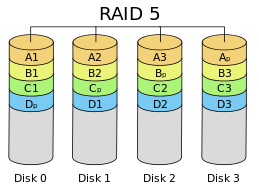

- jako RAID 4, ale paritní a datové bloky jsou rozloženy po všech discích, redukce kolizí u paritního disku při zápisu

RAID 6

- stejně jako RAID 5, ale parita je uložena 2x -> vyrovná se i se ztrátou 2 disků

## Uložení souboru na disku
- Alokační blok - skupina *pevného počtu sektorů*, *následujících logicky* (v souboru) i *fyzicky (na disku) za sebou*, která je *nejmenší jednotkou diskového prostoru*, kterou OS *čte i zapisuje* při běžných operacích (tohle znát jako básničku)
    - tzn. je to nejmenší část paměti, u které je možné říct, že je spojen za sebou logicky i fyzicky

- někdy se tomu říká cluster

## Fragmentace
- dochází k ní při přidělování a uvolňování prostoru pro soubory - externí fragmentace

Negativní dopady

1. Vzniknou nevyužité oblasti diskového prostoru, které se nedají využít buď v daný moment, nebo už nikdy (aniž by se mazalo, nebo přesouval obsah) 
    - v daném okamžiku: mám na disku 50 a 50 MB místa, ale neuložím tam např soubor 100MB, který musí být uložen spojitě i když prostor tam je
    - vůbec - když vznikne menší prostor než je velikost nejmenší adresovatelné jednotky na disku

2. Při nespojitém přidělování prostoru po dostatečně velkých alokačních blocích výše uvedený problém nevzniká, ale data/metadata souboru jsou na disku uložena nespojitě - složitější a pomalejší přístup

### Techniky k minimalizaci externí fragmentace
- rozložení souborů po disku - soubory se neukládají bezprostředně za sebe, je-li to možné
- prealokace - alokuje se více místa, než je momentálně zapotřebí
- odložená alokace - odkládá zápis, než se nabírá více požadavků a je lepší povědomí, kolik je třeba alokovat

Přesto bývají k dispozici nástroje pro defragmentaci

#### **Interní fragmentace**
- nevyužité místo v posledním přiděleném alokačním bloku - plýtvání místem
- některé souborové systéme proto umožňují sdílení posledních alokačních bloků více soubory

## Přístup na disk
- přistupuje se pomocí I/O portů a I/O operací
- načítání dat probíhá přes vyrovnávací paměť disku

### Plánování přístupu na disk
- součástí jádra je subsystém nazývaný plánovač diskových operací
- shromažďuje požadavky od FS /načtení, zapsání dat z/na disk)
- požadavky ukládá do front, požadavky případně přeuspořádá a předává dál disku ke zpracování
- snaží se minimalizovat režii disku
- používá strategii tzv. výtahového algoritmu (SCAN algorithm)
    - snaha, ay hlavička zbytečně nejezdila sem a tam
- plánovač to samo v bledě modrém dělá i pro SSD
    - sbírá data až jich je dostatek pro jeden blok
    - snaha vyvažovat požadavky jdoucí od jednotlivých uživatelů (procesů)
    - implementace priorit
    - ...

## Logický disk
- dělení fyzického disku na logické disky - diskové oblasti

### Způsob uložení informací o diskových oblastech na disku
- MBR - v prvním (nultém) sektoru byla tabulka s rozdělením na 1-4 primární oddíly
    - 4 díl mohl být nahrazen rozšířenou diskovou oblastí, která mohla být nadále rozdělena na podoblasti zvané logické diskové oblasti, každá z nich mohla být popsána formou zřetězeného seznamu
- GUID - vynechaný prostor pro MBR (kompatibilita), disk se může napřímo rozdělit až na 128 oblastí s použitím kryptografie pro identifikaci
- LVM - Logical Volume Manager - správce logických oblstí
    - umožňuje pokročilejší tvorbu logických disků
    - používá se hlavně když mám více fyzických disků

### Formátování
- disk používá nějaký daný souborový systém, občas je nutné si nově koupený disk zformátovat pro použití
- NTFS, ext3, ext4...

### Žurnálování
- slouží pro záznam modifikovaných metadat před jejich zápisem na disk
- obvykle se implemetuje jako cyklicky přepisovaný buffer ve speciální oblasti disku
- operace, které jsou pokryté žurnálováním jsou tzv. atomické (buď se provedou celé, nebo vůbec když to nejde)
- systémy se žurnálem: ext3, ext4, NTFS, JFS...
- vetšinou se nežurnáluje samotný obsah dat (příliš velký obsah)
- umožňuje spolehlivější a rychlejší návrat do konzistentního stavu po chybách
- kompromis mezi žurnálováním a nežurnálováním dat představuje *předřazení zápisu dat před zápis metadat do žurnálu* - zajistí konzistenci tím, že zapsaná data se před zápisem metadat nebudou uvažovat a znovu se přepíší jakmile bude tem rpostor potřeba

#### **Implementace žurnálování**
- implementace na základě dokončení transakcí (REDO), např. ext3/4
    - sekvencedílčích operací se uloží nejprve do žurnálu mezi značky označující začátek a konec transakce, typicky spolu s kontrolním součtem
    - poté se dílčí operace provádí na disku
    - uspějí-li dílčí operace, transakce se ze žurnálu uvolní
    - při selhání se dokončí všechny transakce, které jsou v žurnálu zapsány celé (s korektním kontrolním součtem)
- implementace na základě anulace transakcí (UNDO)
    - záznam dílčích operací do žurnálu a na disk se prokládá
    - proběhne-li celá transakce, ze žurnálu se uvolní
    - při chybě se eliminují nedokončené operace
- UNDO a REDO je možno kombinovat (NTFS)
- implementace žurnálování musí zajišťovat správné pořadízápisu operací

### Alternativy k žurnálování

Copy-on-write
- technika, která se snaží po celou dobu běhu systému udržovat konzistentní stav
- nejprve se nová data či metadata zapíší a až poté se zpřístupní
- změny se prování hierarchicky od listů až po kořen
- na nejvyšší úrovni se udržuje několik verzí kořenového záznamu se zabezpečovacím kódem a časovými razítky
- po chybě bere systém kořen s nejnovějším časovým razítkem a správným kontrolním součtem

- umožňuje snímky (zálohy) souborového sytému - uložení stavu s možností pozdějšího návratu (stačí zálohovat starší verze kořene)
- umožňuje klonování souborového systému - vytvoření kopií, které jsou v budoucnu samostatně manipulovány - vzniká několik kopií kořene, které se pak dělí samostatně (např pro virtuální stroje se to hodí)

**Další alternativy**
- Soft Updates - používá se v UFS (FreeBSD)
    - snaží se analyzovat a sledovat situace a závislosti tak, aby nikdy nenastala nekonzitence
    - uzpůsobuje se tomu pořadí zápisu dat a metadat na disk
- Log-structured file systems - prakticky log všeho o se kdy na disku stalo, v případě chyby se načte poslední verze, přes tu je přístupný poslední stav disku

### Typy souborových systémů
- fs (nejstarší, UNIX)
- ufs, ufs2 - evoluce fs
- ext2, ext3, ext4 - inspirováno zaké z fs
- FAT, FAT32, VFAT, ExFAT - Microsoft, ExFAT je dobrej pro externí disky, protože ho umí většina OS
- NTFS - Microsoft
- .........
- virtuální souborový systém (VFS) - vrstva, která zastřešuje všechny použité souborové systémy a umožňuje pracovat s nimi jednotným způsobem
    - stačí teda zajistit, aby jakýkoli souborový systém komunikoval s VFS

## Klasický UNIXový systém souborů (FS)
- boot blok - pro zavedení systému při startu
- super blok - informace o souborovém systému (typ, velikost, počet i-uzlů, volné místo, volné i-uzly, kořenový adresář, UUID...)
- tabulka i-uzlů - tabulka s popisy souborů
- datové bloky - data souborů a bloky pro nepřímé odkazy

### Modifikace základního rozložení FS
- datové bloky byly rozděleny do skupin
- zaždá skupina měla svoje i-uzly
- důvodem měla být lepší lokalita, prostorová blízkost dat a meradat
- poté tedy ta struktura vypadala takto: boot blok, super blok, úsek i-uzlu, úsek dat, úsek i-uzlu, úsek dat...

### I-uzel
- základní datová struktura, která popisuje každý soubor v UNIXových systémech
- obsahuje metadata souboru, ve speciálních případech i odkaz (např. symbolický odkaz)
- u FS, ext2, ext3 (více modifikováno na ext4...)
    - stav i-uzlu (alokovaný, volný...)
    - typ souboru
    - délka souboru v bajtech
    - mtime - čas poslední modifikace dat
    - atime - čas posledního přístupu
    - ctime - čas poslední modifikace i-uzlu
    - UID - indetifikace vlastníka (číslo)
    - GID - identifikace skupiny (číslo)
    - přístupová práva
    - počet pevných odkazů (jmen)
    - i další věci, v rozšířených variantách
- ne všechny soubory kompatibilní s UNIX-like systémy musí mít i-uzly

- vzniká stromová struktura - vytváří maximální velikost souboru, který se dá na daném systémovém souboru použít

- Teoretický limit velikosti souboru

- velikost souboru je dále omezena dalšími strukturami FS, VFS, rozhraním jádra, architekturou systému (32b, 64b)

### Výhody a nevýhody FS
- je navržena s ohledem na minimalizaci režie
    - hlavně průchod souborem, změna velikosti souborů, náhodný přesun souboru
- snadnost vyhledání adresy prvního bloku
- nalezení určité pozice
- přidávání či ubírání bloků
- FS funguje převážně u malých souborů (historie)
- existuje optimalizace pro zvlášť malé soubory (symbolické odkazy) - v i-uzlu bude (pokud možno) uloženo příme jméno souboru

## Jiné způsoby organizace souborů

### Kontinuální uložení
- jedna spojitá posloupnost na disku
- jednoduché nalezení počátku, nebo určitého bloku
- problémy se zvětšováním souborů díky externí fragmentaci

### Zřetězené seznamy bloků
- každý datový blok obsahuje krom dat také odkaz na další blok (nebo příznak konce souboru)
- pro přístup k náhodným blokům je potřeba projít celý soubor
- chyba kdekoli na disku může způsobit velkou ztrátu dat
- problém při změně velikosti (pokud není uložen i odkaz na konec, tak je nutné projít celý soubor)
    
    

### FAT (File Allocation Table)
- seznamy uložené ve speciální části disku
- na začátku disku je tabulka FAT, která má každou položku pro každý blok
- do této tabulky vedou odkazy z adresářů
- bloky se mohou řetězit
- opět vznikají problémy s náhodným přístupem, ale lepší protože tabulka je v metadatech
- tabulka může být zdvojená, takže není problém ji uložit vícekrát pro vyšší spolehlivost
    
    

### B+ stromy
- datová struktura převzatá z databází
- dva typy uzlů
- Vnitřní uzly - obsahují sekvenci *link0, key0, link1, key1...*
    - je to kořen, jeho následníci (kromě listových) obsahují odkaz na následníka a vyhledávací klíč
    - klíče jsou jen čísla bloků
    - link (odkazy) - odkazy na nižší části bloků, případně odkazy přímo na data
- Listové uzly - mají podobnou strukturu jako vnitřní uzly
    - odkazy na jajich úrovni vedou přímo na data
    - na listové úrovni jsou bloky zřetězené do jednoho seznamu

#### **Vyhledávání v B+ stromu**
- při hledání klíče *k* se podívám, zda je klíč menší jak klíč *k0*, pokud ano tak jdu níž, pokud ne tak zjistím jestli je mezi *k0* a *k1*, pokud ano, jdu druhým směrem, takto opakuji až po *kn*
- pokud jsem níž opakuji to samé co výš, dokud nedojdu k lisotvým uzlům
- zde hledaný klíč najdu nebo zjistím, že v této struktuře není
    
    

#### **Práce s B+ stromy**
- strom zůstává výškově vyvážený - všechny cesty od kořene k listům mají stejnou délku
- jsou zde limity, jak moc/málo mají být uzly zaplněné - pro uzly s m odkazy máme klíče 0, 1...m - 2 klíčů (odkazů je o 1 méně jak klíčů + číslování od 0)
- pokud je strom tvořen jediným kořenem - nejméně může mít jeden odkaz, max. *m-1* odkazů (poslední odkaz je použit jako ukončovač seznamu listů, protože v tomto případě je kořen také list)
- pokud to není jediný kořen, tak má nějaké následníky, minimálně jich má 2, maximálně *m*
- vložení:
    - děje se na listové úrovni, tzn. projdeme strom od kořene k listům
    - najedem, kam chceme vložit
    - podíváme se, zda má list volný odkaz
    - pokud ano, použijeme ho, pokud ne, list se rozštěpí na dvě poloviny a podívám se o úroveň výš, zda je možné namísto 1 listu linkovat dva listy
    - pokud ano, přidá se odkaz, pokud ne, nadřazený uzel se musí rezštěpit a postupovat o úroveň výš
    - štěpí se tak dlouho, až se případně roštěpí kořen a strom bude mít dva kořeny, které navážu na nový hlavní kořen
- rušení:
    - zase funguje od listů, zruší se odkaz v listu
    - zkontroluje se, zda je uzel zaplněný v rámci daných limitů
    - pokud nao, good, pokud ne podívám se na sousední uzly a pokusím se provést přerozdělení tak, aby byly všechny uzly naplněny v rámci limitů
    - pokud se to nepodaří, tak dojde ke sloučení listů
    - posunu se o úroveň výš, zruším jeden odkaz a repete
    - přinejhorším se může stát, že se zruší i kořen

- B+ stromy a jejich různé varianty jsou použity pro popis diskového prostoru přiděleného souborům v různých souborových systémech
    - XFS, JFS, ReFS, APFS, Btrfs
    - ve zdegenerované podobě i u NTFS a ext4

- určitě se hodí si vyzkoušet simulaci B+ stromu ze stránek IOSu

#### **Extent**
- proměnná jednotka diskového prostoru (ale min. 1 alokační blok); sektor -> alokační blok -> extent
- posloupnost proměnného počtu bloků jdoucích za sebou logicky v souboru a uložených i fyzicky na disku za sebou
- zrychluje se práce s velkými soubory, menší objem metadat, které je třeba procházet a udržovat, lepší lokalita dat a metadat
- přináší lépe vyvážené indexové struktury
- umožňuje nám říct "Tady mám začátek bloky, je spojitý a obsahuje jich tolik a tolik" na rozdíl od hromady odkazů na po sobě jdoucí bloky, které bychom museli uchovávat
- snadno se dopňují do B+ stromů, ale nedá se kombinovat s UNIXovými stromy
- nehodí se používat pro malé soubory v B+ stromů

### ext4 - strom extentů
- analogie B+ stromu bez vyvažování a bez zřetězení listů
- omezený počet úrovní na mx. 5
- kořen v i-uzlu má max 4 odkazy
    
    

- malé soubory - až 4 extenty odkazované přímo z kořenového uzlu extentového stromu umístěného v i-uzlu, příp. data přímo v i-uzlu (symbolické odkazy)
- při přeplnění i-uzlu se vytvoří nový, plnohodnotný indexový uzel, do něj se přesunou odkazy, v kořeni zůstane jeden. Časem se může zaplnit atd...

### NTFS
- MFT - Master File Table - každý soubor má alespoň jeden řádek, samotná je uložená na disku (MFT obsahuje MFT)
- oproti i-uzlu se na řádku nachází i jméno souboru
- pokud jsou data dostatečně malá, tak jsou rovnou na řádku
- pokud nejsou, tak dávám extent na disk
    
    

- LCN = fyzický blok, VCN - logický blok

### Organizace volného prostoru
- používá se bitová mapa s jedním bitem pro každý blok (případně rozdělená na několik částí, pokud je disk rozdělen na několik skupin bloků)
    - umožňuje zrychlit vyhledávání volné souvislé části pomocí bitového maskování
- další organizace volného prostoru:
    - seznam - zřetězení volných bloků
    - označení (zřetězení) volných položek v tabulce bloků (FAT)
    - B+ strom - adresace velikostí nebo offsetem
- volný prostor může být organizován také po extentech

### Deduplikace
- snaka odhalit opakované ukládání totožných dat, uložit je jenou a odkazovat se na ně vácenásobně
- podporováno na více úrovních - sekvence bytů, bloky, extenty, soubory
- založeno na kryptografickém hashování
- může se implementovat při zápisu nebo dodatečně (na přání)
- spoří diskový i paměťový prostor
- při menším objemu duplikace může naopak zvyšit spotřebu procesorového času, paměťového i diskového souboru

## Soubory v UNIXu (více uživatelsky)

### Typy souborů v UNIXu
- -(pomlčka) - obyčejný soubor
- d - adresář
- b - blokový speciální soubor
- c - znakový speciální soubor
- l - symbolický odkaz (symlink)
- p - pojmenovaná roura
- s - socket

### Adresář
- soubor souborů
- obsahuje množinu dvojic (hard links) - číslo souboru (číslo i-uzlu u klasických UNIX systémů) a jméno souboru
- jméno souboru - dnes až 255 znaků, krom / a \0 může mít jakékoli znaky
    - pozor, ještě existuje limit na délku cesty (Linux 4096 znaků)
- číslo souboru - klasicky čísli i-uzlu, v jiných případech může sloužit jako klíč pro vyhledávání v B+ stromu
- adresář vždy obsahuje alespoň dvě jména: . a ..
- Implementace 
    - seznam
    - B+ stromy a jejich varianty (NTFS, APFS, ext3/4(H stromy))
    - hashovací tabulky

Soubor v UNIXu může mít více jmen - příkaz *ln*
- obě jména musí být v rámci jednoho logického disku
- takto se musí napřed smazat všechny soubory než se smaže, dokud není počet souborů 1 tak se nesmaže
- pokud číslo souboru odkazuje přímo na první blok na disku (tedy není i-uzel), pak to nelze moc dobře aplikovat

### Montování disků
- analogie k C:, D: ... ve Windows (logickým diskům)
- princip montování disků
    - všechny soubory jsou v jednom stromu adresářů
    - v systému je jeden kořenový logický disk, další logické disky lze připojit programem mount do již existujícího adresářového stromu
- příkaz *mount*
    
    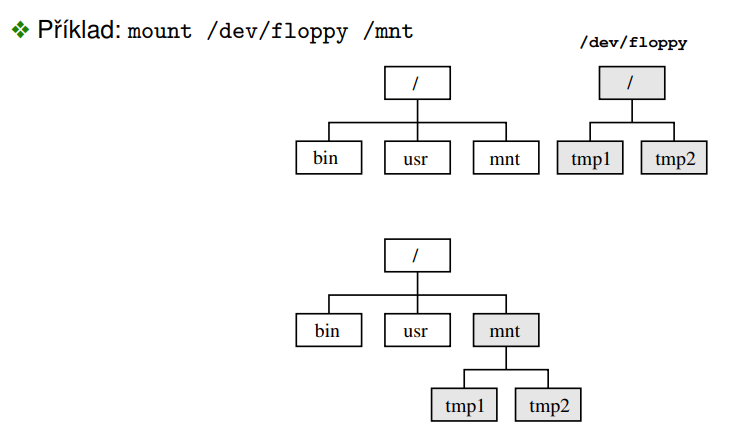

- *mount* má spoustu dalších využití, viz *man mount*

**Poznámky**
- /etc/fstab - popsi disků typicky připojovaných na určité pozice adresářového stromu
- /etc/mtab - tabulka aktuálně připojených disků
- udev - používá se pro automatické montování nově připojených zařízení, dynamicky vytváří rozhraní souborového systémmu na zařízení v adresáři /dev
- Automonter - připojuje disky do aktuálního adresáře
- Union mount - prioritizuje disky, montuje více disků do jednoho místa
    - má copy-on-write sémantiku: umožňuje nám přeisovat nepřepisovatelné

### Symbolické odkazy
- soubor, jehož obsahem je jméno jiného souboru
- příkaz *ln -s [cílový soubor] [symbolický odkaz]*
- systém při otevření souboru automaticky provede otevření cílového souboru
- rychlé symlinky: uloženy v i-uzlu
- pomalé symlinky: uloženy ve zvláštním souboru (používá se pokud je cesta, která definuje symlink příliš dlouhá pro uložení do i-uzlu)
- můžou jít napříč logickými disky
- můžeme smazat soubor na který odkazují, když soubor neexistuje tak se vyhlásí chyba
- zacyklení se řeší maximálním počtem úrovní odkazů

### Blokové a znakové speciální soubory
- implementují souborové rozhraní k fyzickým či virtuálním zařízením

    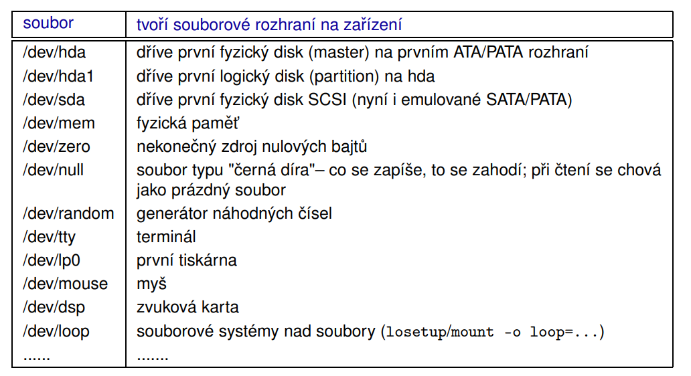

- výhodou zavedení těchto souborů je, že programy mohou použít běžné souborové rozhraní pro práci se soubory i pro čtení/zápis z různých zařízení

    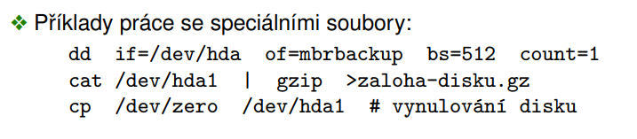

### Přístupová práva
- v UNIXu jsou typicky rozlišena práva pro vlastníka, skupinu a ostatní
- Uživatelé (vlastníci)
    - definuje je administrátor v /etc/passwd
    - UID - číslo identifikující uživatele (root - 0)
    - Příkaz *chown* - změna vlastníka (pouze root)
- Skupiny
    - skupiny definuje administrátor v /etc/group
    - GID - číslo identifikující skupinu uživatelů
    - uživatel může být členem více skupin, jedna z nich je vždy aktuální
    - ve své primární skupině v /etc/passwd nemusí být uživatel v /etc/group uveden
    - *groups* - výpis skupin uživatele
    - *chgrp* - změna skupiny souboru
    - *newgrp* - nový shell s jiným aktuálním GID

#### **Typy přístupových práv** 
- práva se dají vyjadřovat i číselně v osmičkové soustavě
    
    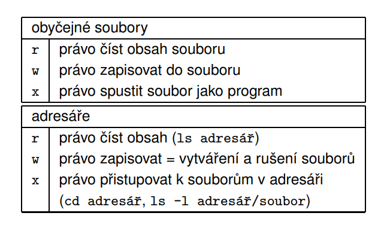

- změna přístupových práv - příkaz *chmod*
- výpis informací o souboru - příkaz *ls -l*

### Sticky bit
- příznak, který nedovoluje rušit či přejmenovávat cizí soubory (typicky u /tmp), i když mají všichni právo zápisu
- *chmod +t [adresar]* - nastaví sticky bit

### SUID, SGID
- souvisí s tím, že užovatel může spouštět program, který spravuje jiný uživatel

    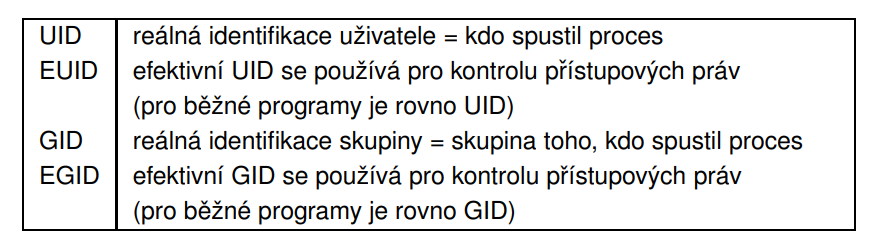

- vlastník programu může propůjčovat svoje práva komukoli, kdo spustí program s nastaveným SUID
- např. - soubor /etc/shadow (obsahují hesla), do něj má přístup pouze root, tak nám root dá SUID na zápis abychom si mohli měnit heslo sami a nemuseli chodit na ním

### Typická struktura adresářů v UNIXu
- (jen se orientovat, znát nazpaměť to na zkoušku úplně nepotřebujem xd)

    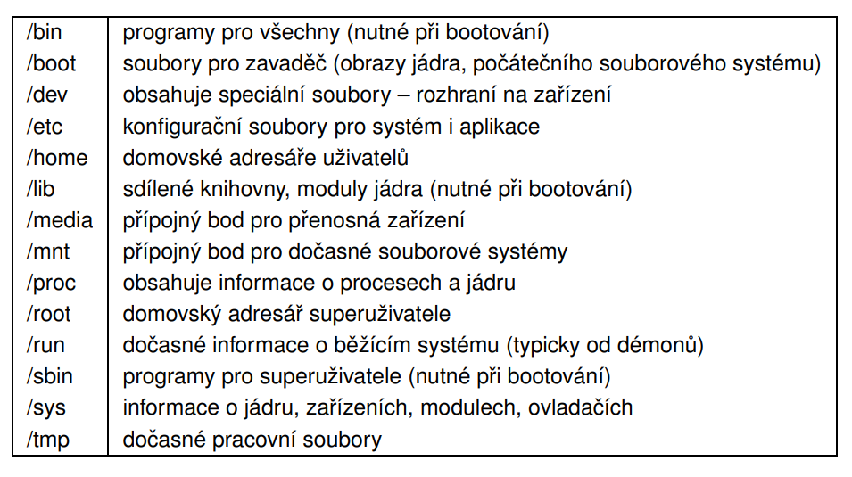
    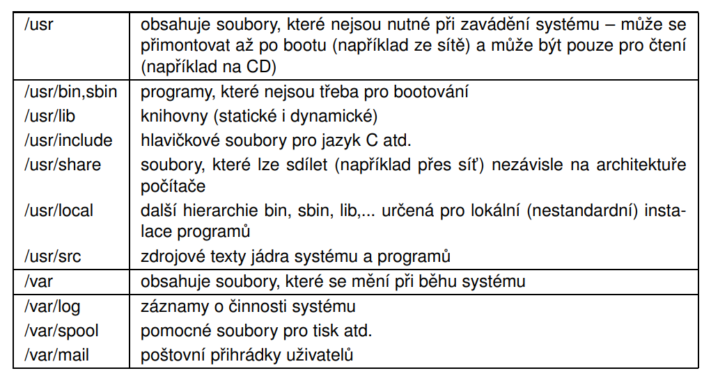

## Datové struktury a algoritmy pro vstup/výstup

### Použití vyrovnávacích pamětí
- používají se proto, aby se minimalizovaly počty pomalých operací s diskem (čtení nebo zapisování přímo na disk), kvůli rychlosti
- I/O buffering
    - buffer - vyrovnávací paměť (VP)
    - dílčí vyrovnávací pamětí mívají velikost alokačního bloku (případně jejich skupiny) a jsou sdruženy do kolekce
- Možná implementace

    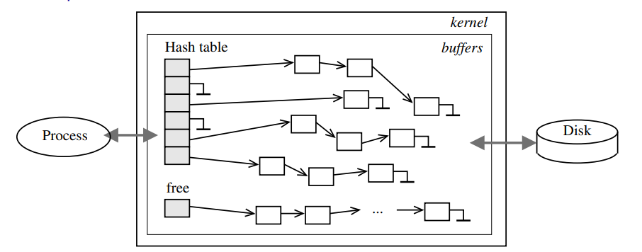

- pro zvýšení rychlosti se vede seznam předalokovaných volných bufferů, aby se nemusely alokovat až v okamžiku kdy jsou potřeba

#### **Čtení (read)**
- První čtení
    1. podívám se do kolekce vyrovnávacích pamětí a zjistím že tento alokační blok není k dispozici -> načtu ho do vyrovnávací paměti jádra (běžné procesy sem nemají přístup)
    2. vykousne se ta část bloku, kterou uživatel chce na adresu kterou si uživatel řekne (RAM -> RAM)
- Druhé čtení
    1. pouze krok 2. v prvním čtení (minimalizace operací s disky)

    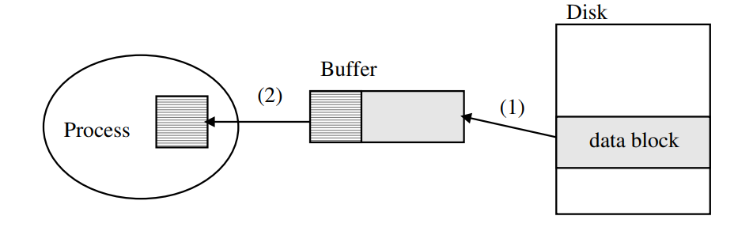

- pokud při čtení překročíme hranice načteného bloku tak provedeme opět postup prvního čtení

#### **Zápis (write)**
- První zápis
    1. musím naalokovat novou vyrovnávací paměť a načíst do ní data z disku
    2. zapíšeme data do vyrovnávací paměti (RAM -> RAM), nastaví se příznak modifikace (v tento moment zápis skončí, data jsou pouze v RAM)
    3. zpožděný zápis na disk, nuluje se příznak (dirty bit); dělá ho jádro automaticky, ale uživatel si to může vynutit pomocí *fsync* a *sync*
- Druhý (a další zápis)
    1. bez alokace první zápis

    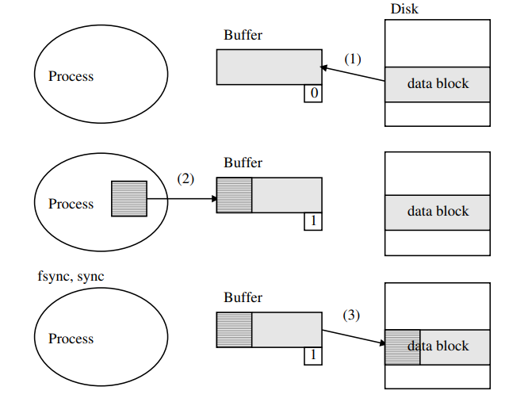

Obecně první operace (čtení nebo zápis) způsobí načtení a pak se už pracuje ve vyrovnávací paměti

### Otevření souboru pro čtení !!!
- používá se pro to volání *open*
- *fd = open ("/dir/file", O_WRONGLY | O_CREAT | O_EXCL)* - pouze příklad
- v případě že soubor ještě nebyl otevřen:
    1. vyhodnotí se cesta a nalezne se číslo i-uzlu (ten mi říká, kde vlastně jsou data souboru)
        - při tom se postupně načítají i-uzly všech adresářů vedoucí na soubor
        - poté se načte i-uzel souborů
        - systém používá *d-entry chache* (speciální vyrovnávací paměť použitá pro překlad odpovídajících jmen souborů na i-uzel)
        - dále se alokuje položka v tabulce **V-uzlu**
        - z disku se načte i-uzel
        - vloží se do nově alokované položky = vzniká rozšířená kopie i-uzlu
        - budou tam i informace navíc (jako je počet odkazů na danou položku - s daným i-uzlem může pracovat více procesů)
    2. v tabulce popisovačů vytvoříme novou položku
        - tato tabulka je uložena v záznamu o procesu (tabulka procesou v jádře) nebo v uživatelské oblasti
        - použije se nejnižší volná položka zde
        - naplní se odkazem na položku v tabulce otevřených souborů
    3. pokud se otevření vydaří, vrátí se číslo popisovače, pokud ne tak se vrací -1

    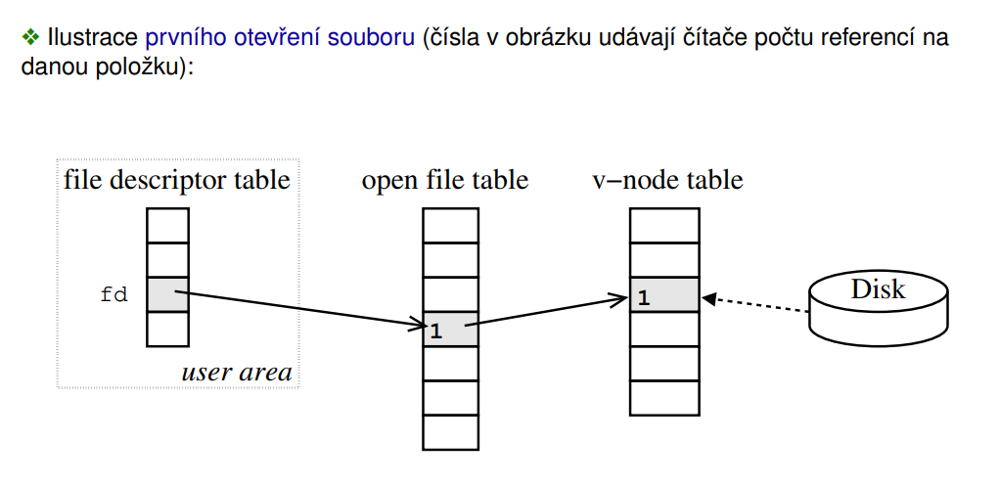

- tolik tabulek se zavádí pro zamezení duplikace údajů
- během otevírání se provádí kontrola přístupových práv (nejen u hledaného souboru, ale pro všechny adresáře kterými procházím)
- soubor se může otevřít pro čtení, pro zápis a pro čtení i zápis

- pokud chci již otevřený soubor otevřít znovu
    1. vyhodnotí se cesta a získá se číslo i-uzlu
    2. v systémové tabulce v-uzlů se nalezne již načtený i-uzel; tabulka v-uzlů musí být implementována za tímto účelem jako vyhledávací tabulka
    3. zvýší se počítadlo odkazů na v-uzel o 1 (nebudu znovu načítat i-uzel z disku, když už ho jednou mám načtený)
    4. naalokuje se nová položka v tabulce otevření (naplní se režimem otevření, pozicí, odkazem na sdílený v-uzel)
    - naalokuje se nově položka ve file descriptoru ukazující na nové otevření

    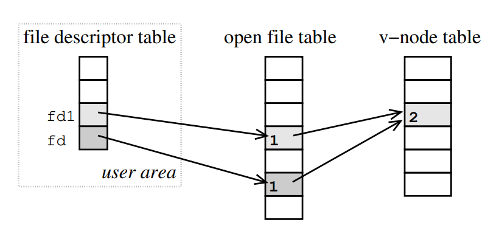

- můžu základní režim modifikovat např.:
    - vytvoření / povinné vytvoření souboru
    - zkrácení na 0
    - přidávání (kdekoli je aktuálně ukazovátko v souboru, tak v případě zápisu se automaticky posune na konec a tam se přidá)
    - synchronní zápis - operace zápisu skončí až tehdy, když se data dostanou na disk
- při chybě:
    - *open()* vrací -1
    - do stadndardní knihovní proměnné *errno* se nastaví chybový kód, který blíže popisuje co se stalo
    - existují standardní chybové kódy
    - lze použít standardní knihovní fci *perror()*

### Čtení a zápis z/do souboru

- Čtení ze souboru *n = read(fd {soubor}, buf {kam to chci načíst}, 3000 {kolik toho chceme načíst, v bajtech})*
    1. kontrola platnosti *fd*
    2. v případě že jde o první přístup tak dojde k alokaci VP a načtení bloků z disku do VP; jinak dochází k alokaci VP a diskové operarci jen tehdy, když je to nutné
    3. kopie požadovaných dat z VP (RAM, jádro) do pole *buf* (RAM, adresový prostor procesu)
    4. funkce vrací počet *reálně* načtenych bajtů nebo -1 při chybě
    - pozor, neprovádí se kontrola, zda je buffer dostatečně velký!!
- Zápis do souboru *n = write(fd {soubor}, buf {co tam chci zapsat}, 3000 {kolik toho chci zapsat})*
    - funguje podobně jako *read*
    - před vlastním zápisem kontroluje dostupnost diskového rpostoru a prostor rezervuje
    - funkce vrací počet *reálně* zapsaných bajtů nebo -1 při chybě

### Přímý přístup k souboru (seek)
- *n = lseek(fd {soubor}, offset {o kolik se chceme posunout}, whence {oproti čemu se ten posun děje (začátek, konec, aktuální pozici)})*
- souvisí s náhodným přístupem k souboru
- většinou se čte soubor od začátku do konce, ale je možné přistupovat náhodně -> k tomuto slouží *lseek*
- Postup:
    1. kontrola platnosti *fd*
    2. nastaví pozici na *offset* bajtů podle *whence*
    3. vrací vrací výslednou pozici od začátku souboru nebo -1 při chybě
- hodnota parametru může být záporná, nelze však nastavit pozici před začátek souboru (ale můžeme za konec souboru, viz. tzv. řídké soubory dále)

#### **Zápis za konec souboru (řídké soubory)**
- vznikají nastavením pozice za konec souboru a zápisem
- v souboru vznikají části, na které jsem nikdy nešáhl
- bloky, do kterých se nezapisovalo nejsou alokovány a nezabírají prostor na disku, při čtení se považují za vynulované
- někdy také tzv. hole punching: mazání prostoru uvnitř souboru (např. *fallocate*)

    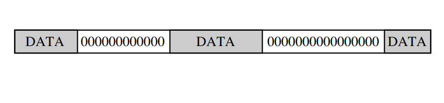

### Zavření souboru
- funkce *close(fd)*
- Postup
    1. kontrola platnosti *fd* (zda jsme to vůbec otevřeli)
    2. uvolní se odpovídající položka v tabulce deskriptorů, sníží se počítadlo odkazů v odpovídající položce tabulky otevřených souborů
    3. pokud je počítadlo odkazů nulové, uvolní se odpovídající položka v tabulce otevřených souborů a sníží se počítadlo odkazů v i-uzlu
    4. pokud je počítadlo odkazů nulové, i-uzel se z v-uzlu okopíruje do VP a uvolní
    5. vrací se 0 nebo -1 při chybě
- uzavření souboru nezpůsobuje uložení obsahu jeho VP na disk!
- nemusí se zapisovat ani data ani metadata souboru zpátky na disk

### Duplikace deskriptoru souboru
- používá se při přesměrování (ne podle jména souboru, ale třeba na stderr atd)
- *fd2 = dup(fd)*
- *fd2 = dup2(fd, newfd)*
- Postup:
    1. kontrola paltnosti *fd*
    2. kopíruje danou položku v tabulce deskriptorů do první volné položky (dup) nebo do zadané položky (dup2). Je-li dekriptor *newfd* otevřen, dup2 ho automaticky zavře
    3. zvýší počítadlo odkazů v tabulce tevřených souborů
    4. vrací index nové položky nebo -1 při chybě

    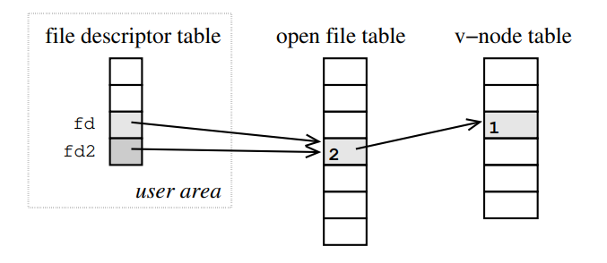

### Rušení souboru
- *x = unlink("/dir/file")*
- Postup:
    1. vyhodnocení cesty, kontrola platnosti souboru a přístupových práv
    2. pokud je vše v pořádku, tak se odstraní pevný odkaz mezi jménem souboru a jeho i-uzlem
    3. v i-uzlu na disku se sníží počet odkazů na tento uzel
    4. dokud tento počet neklesne na 0, tak se reálně nic nemaže
    5. vrací se 0 nebo -1 při chybě
- můžeme provést *unlink* na otevřený soubor a dále s ním pracovat až do zavření (hodí se při upgradování na novou verzi)
- můžeme zrušit i spustitelný soubor (výhoda při instalaci nových verzí programů)
- bezpečnější mazání: *shred*

### Další operace se soubory
- vytvoření souboru: creat (není to překlep), open
- přejmenování: rename
- zkrácení: truncate, ftruncate
- zamykání záznamů: fcntl, lockf (používá se pro zamykání částí souborů, abych si je nepřepisoval)
- změna atributů: chmod, utime
- získání atributů: stat
- zápis VP (vyrovnávací paměť) na disk: sync, fsync

### Adresářové soubory
- adresáře se liší od běžných souborů
    - vytváří se pomocí *mkdir*
    - otevření: *opendir*
    - čtení: *readdir*
    - uzavření: *closedir*
    - modifikace či zápis se prování nepřímo přes vytváření a rušení souborů v adresářu
- adresáře nelze číst/zapisovat po bajtech

### Blokové a znakové speciální soubory
- soubory, u nichž se vypisuje *b* nebo *c*
- často jsou v /dev
- rozhraní k blokovým/znakovým zařízením fyzickým i virtuálním (disky, logické disky, terminály, myš, paměť...)
- vytváří se přes *mknod*
- normálně toto řeší přímo jádro nebo démoni (*udev*, *devd*)
- např. připojení nového disku vyvolá HW přerušení, které zavolá *udev*, ten vytvoří např. /dev/sda1; poté se zavolá něco na otevření okénka atd. atd. (jako když připojím flashku)
- jádro musí mapovat běžné souborové operace (*open, read*) nad blokovými a znakovými spec. soubory na odpovídající podprogramy tyto operace implementující nad příslušným zařízením prostřednictvím dvou tabulek: (ve zkratce jinak se čte z myši, jinak z klávesnice...)
    - tabulky znakových zařízení
    - tabulky blokových zařízení
- ovladač (device driver) je v podstatě jen sada podprogarmů pro řízení určtého typu zařízení
- tyto soubory jsou tvořeny pouze i-uzlem - obsahují klasiku jako práva atd., pak typ a **hlavní číslo** (typ zařízení) a **vedlejší číslo** (kolikátý typ zařízení to je)

    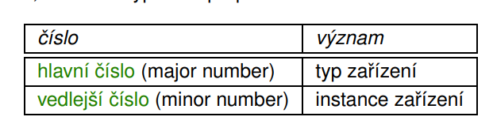

    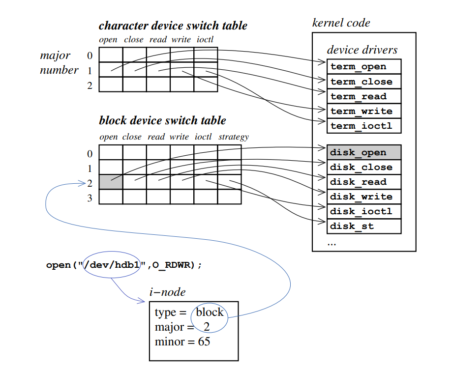

### Terminály
- není to soubor
- fyzické nebo virtuální zařízení, které umožňuje (primárně) textový vstup/výstup systému
- implementují vstup a výstup po řádcích / pokračovacích řádcích(\\), nebo implementace speciálních znaků (Ctrl+C, Ctrl+D...)
- Rozhraní
    - /dev/tty, ... - vnitřně svázán s řídícím terminálem aktuálního procesu
    - /dev/ttyS1, ... - terminál na sériové lince
    - /dev/tty1, ... - virtuální terminály (konzole)
    - pseudoterminály (např. /dev/ptmx a /dev/pts/1...) - tvořeny párem master/slave, emulujícím komunikaci přes sériovou linku (např. použito u X-terminálu, bash nebo ssh)
- příkaz *tty* vypíše aktuální terminál

Na terminálu můžo ovlivňovat jeho nastavení (pomocí nastavení ovladače terminálu, nebo přímo na zařízení) - program *stty*
- různé režimy zpracování znaků
    - raw - bez zpracování
    - cbreak - zpracovává jen některé znaky (zejména Ctrl+C, mazání)
    - cooked - zpracovává vše
- nastavení režimu terminálu (tedy fyzického zařízení nebo emulujícího programu)
    - proměnná TERM - typ aktuálního terminálu
    - databáze popisu teminálů (možností nastavení terminálu): *terminfo* či *termcap*
    - nastavení příkazy - *tset, tput, reset,...*
- knihovna *curses* - standardní knihovna pro řízení terminálu a tvorbu aplikací, umožňuje nám vytvářet aplikace s terminálovým uživatelským rozhraním (včetně menu, textových oken..., např. midnight commander)

### Roury
- jeden z typů speciálních souborů
- dva typy:
    - roury nepojmenované
        - nemají adresářovou položku
        - *pipe* vrací dva descriptory (čtecí a zápisový), jsou přístupné pouze příbuzným procesům (procesy vyklonované přes původního "předka", který rouru vytvořil)
        - vytváří se v kolonách (např. p1 | p2 | p3)
    - roury pojmenované - vytvoření *mknod* nebo *mkfifo*
        - mají položku v adresářovém stromě
- roury reprezentují jeden z mechanismů meziprocesové komunikace
- implememtace: kruhový buffer s omezenou kapacitou, omezení se může lišit na různých systémech
    - pole, ve kterém se pohybují dvě ukazovátka, které se pohybují tak, že když dojdou na konec tak jsou zase na začátek
- procesy, které komunikují přes rouru jsou synchronizovány (když chci brát data a nemám je tak čekám, a když chci zapisovat data a buffer je přeplněný, tak čekám až se vyprázdní)

### Sockets
- umožňují síťovou i lokální komunikaci
- lokální komunikace může probíhat přes sockety pojmenované a zpřístupněné v souborovém systému
- umožňují mi vytvářet aplikace, které spollu mohou komunikovat po síti, ale i lokálně (komunikují efektivněji)
- API pro práci se sockets:
    - vytvoření: *socket*
    - čekání na připojení: *bind, listen, accept*
    - připojení ke vzdálenému počítači: *connect*
    - příjem a vysílání: *recv, send, read, write*
    - uzavřený: *close*
- podporují blookující (nemám data -> čekám) i neblokující (nemám data -> skončím okamžitě s chybovou hláškou) I/O
- pro současnou obsluhu více socketů jedním procesem (vláknem) můžu použít *select*
    - testuje dostupnost/čeká na dostupnost operace na množině popisovačů
    - *select* můžem použít i u dalších souborů

### VFS
- Virtual File System
- souborový systém, který neexistuje přímo na disku
- vytváří jednotné rozhraní pro práci s různými souborovými systémy, zastřešuje je
- veškerá komunikace vně souborového systému jde přes VFS a to to předává dál
- je na vývojářćh vývojových systémů, aby zajistili komunikaci s VFS (jinak to nikdo nebude používat)
- pro popis souborů používá rozšířené i-uzly (tzv. v-uzly)
- v-uzly jsou rozšířené paměťové kopie i-uzlů (v systémech co ty i-uzly používají)
    - dále obsahují dodatečnou informaci, např. ukazatele na soubory pro daný souborový systém (jak se tady dělá open, close...)
- v systémech co i-uzly nepoužívají se v-uzlyy stejně používají a musí se doplňovat informacemi, které suplují i-uzel

    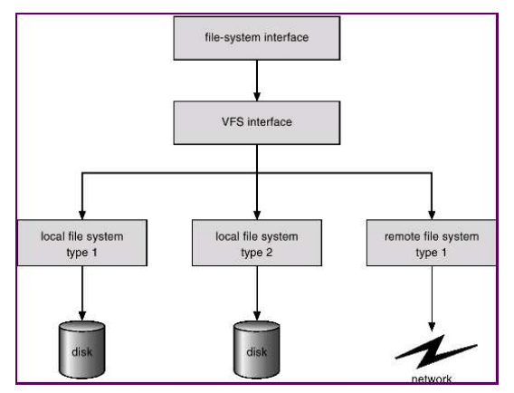

### NFS
- Network File System
- transparentně zpřístupňuje soubory uložené na vzdálených systémech
- využívá systém klient-server

    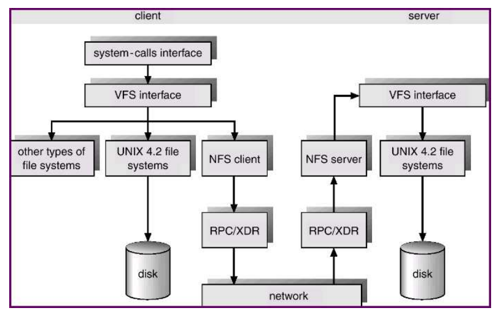

- umožňuje tzv. kaskádování (lokální připojení vzdáleného adresářového systému do jiného vzdáleného adresářového systému)
- autentizace prostřednictvím uid a gid - pozor na bezpečnost!
- NFS verze 3:
    - bezestavové - operace otevírání a zavírání jsou prázdné, musí v sobě nést informaci odkud se čte / zapisuje...
    - na straně klienta se nepoužívá cache
    - nemá podporu zamykání
- NFS verze 4:
    - stavové
    - cache na straně klienta
    - podpora zamykání

### Spooling
- simultaneous peripheral opearions on-line (paralelní provádění periferních operací)
- typicky u výstupních zařízeních (tiskárny)
- spool - vyrovnávací paměť (typicky soubor)
- výstup je proveden do souboru, požadavek na jeho fyzické zpracování se zařadí do fronty, proces, který tiskl, může pokračovat a zpracování dat provede sytém než na ně přijde řada
