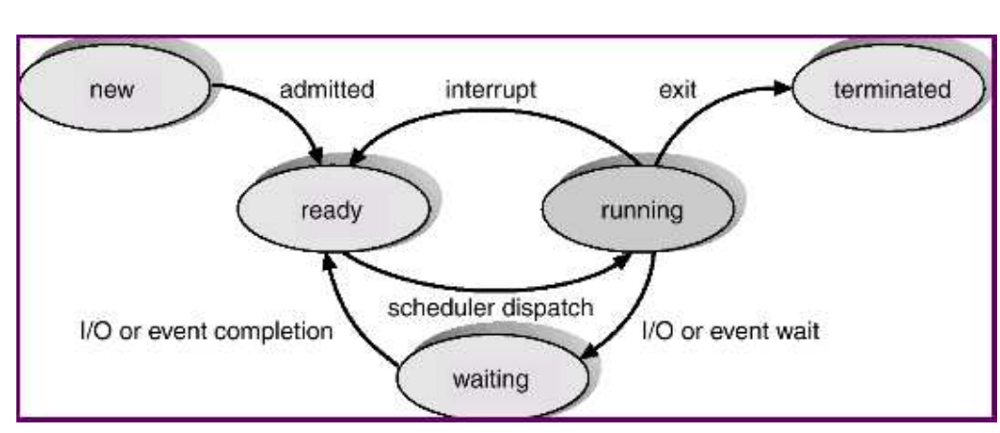
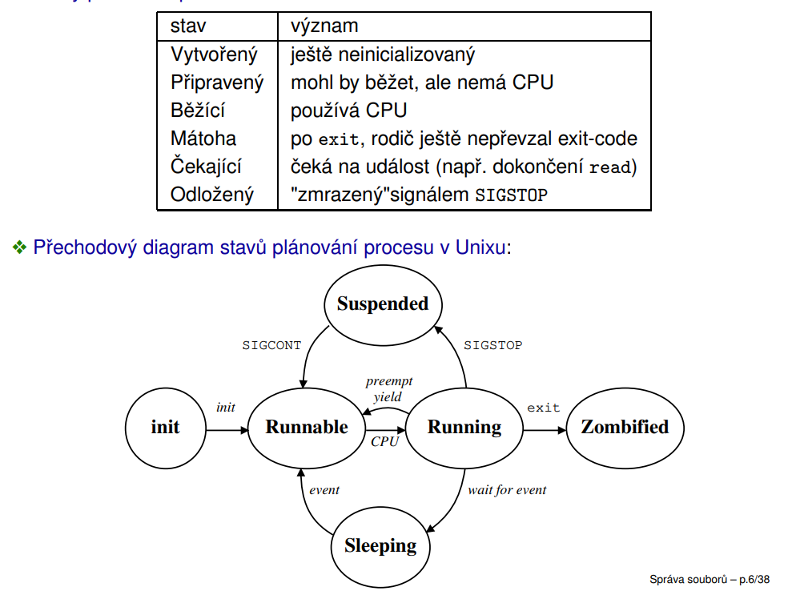
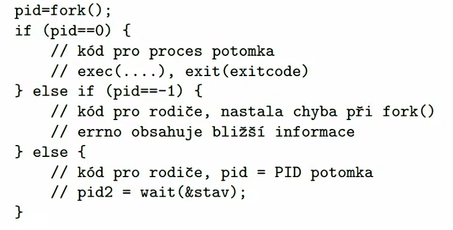

30.3.2022

# Procesy - správa procesů

- zahrnuje:
    - přepínání kontextu (dispatcher) - fyzické odebírání a přidělování procesoru na základě rozhodnutí plánovače
    - plánovač (scheduler) - rozhoduje, který proces poběží na procesoru, jak dlouho...
    - správu paměti (memory management) - přiděluje paměť, procesy by si neměly navzájem šahat do paměti
    - podporu meziprocesové komunikace (IPC) - signály, RPC... (tohle je hlavní část 2. projektu)

## Proces
- běžící program (program je sekvence příkazů)
- proces je v OS definován:
    - identifikátorem (PID)
    - stavem jeho plánování
    - programem, kterým je řízen
    - obsahem registrů (včetně EIP a ESP apd.)
    - zásobníkem - rozpracované funkce
    - daty - statická inicializovaná a neinicializovaná data, hromada, individuálně alokované úseky paměti
    - využitím dalších zdrojů OS a vazbami na další objekty OS, otevřené soubory, signály, PPID, UID, GID, semafory, sdílená paměť, sdílené knihovny...

### Stavy plánování a jejich změny
- běžně se rozlišují následující stavy procesů

    

- new - první fáze tvorby procesu, ještě proces nemůže běžet
- ready - je schopen běžet, ale ještě neběží
- running - poté co ho plánovač naplánuje tak se někdy dostane na procesor a běží, může přejít do několika stavů:
    - terminated - nejjednodušší, ukončení procesu, ještě furt zůstává v systému ale jen čeká až si někdo převezme jeho návratovou hodnotu
    - ready - přesune se zpět poté pomocí interrupt (nebo se může sám proces vzdát procesoru), co procesor usoudí že běžel dlouho nebo tak
    - waiting - čeká na něco, např. na načtení dat z disku, během tohoto stavů procesu může na procesoru běžet něco jiného, z tohoto stavu se dostaneme až doběhne ten proces na který čekal, přejde do stavu ready

**Stavy plánování procesu v UNIXu**

- trochu jinak napsaný to co je výš; mátoha = zombified

    

### PCB - Process Control Block
- proces bývá v OS reprezentován strukturou PCB (Process Control Block)
- PCB zahrnuje:
    - indentifikátory spojené s procesem (identifikátor procesu, identifikátor rodiče procesu, identifikátor uživatele)
    - stav plánování procesu
    - obsah registrů (jen když není ve stavu running)
    - plánovací informace (priorita, ukazatele na plánovací fronty...)
    - informace spojené se správou paměti (tabulky stránek...)
    - informace spojené s účtováním (spotřeba procesoru...)
    - využití I/O zrojů (otevřené soubory, používaná zařízení...)
- PCB se někdy rozděluje do několika dílčích struktur

### Části procesu v paměti UNIXu
- uživatelský prostor (user adress space) přístupný procesu:
    - to co normálně vidíme
    - kód (code area/text segment)
    - data (incializovaná/neinicializovaná data, hromada, individuálně alokovaná paměť)
    - zásobník
    - soukromá data sdílených knihoven, sdílené knihovny, sdílená paměť
- uživatelská oblast (user area) - ne vždy použita:
    - uložena zvlášť pro každý prces spolu s daty, kódem a zásobníkem v user adress space příslušného procesu (s nímž může být odložena na disk)
    - je ale přístupná pouze jádru
    - obsahuje část PCB, která je používána zejména za běhu procesu
        - PID (id procesu), PPID (id rodiče procesu), UID (id uživatele), EID, GID, EGID
        - obsah registrů
        - diskriptory souborů
        - obslužné funkce signálů
        - účtování (spotřebovaný čas CPU...)
        - pracovní a kořenový adresář...
- záznam v tabulce procesů (process table)
    - uložen trvale v jádru
    - obsahuje zejména info o procesu
        - PID, PPID, UID...
        - stav plánování
        - událost na kterou se čeká
        - plánovací informace (priorita, spotřeba času...)
        - čekající signály
        - odkaz na tabulku paměťových regionů procesu
- tabulka paměťových regionů v procesu (per-process region table) - popis paměťových regionů rocesu (spojitá oblast virtuální paměti použitá za určitým účelem: data, kód, zásobník, sdílená paměť) + příslušné položky tabulky regionů, tabulka stránek
- zásobník jádra - speciální zásobník v adresovém prostoru procesu, který není dostupný tomu samotnému procesu, který se používá když chceme volat nějakou službu jádra tak se tato služba prování na tomto zásobníku, protože většinou nechceme tuto službu volat do stejného zásobníku kde je proces (malá velikost zásobníku)

### Kontext procesu
- kontext procesu = stav procesu
- rozlišujeme:
    - uživatelský kontext - kód, data, zásobník, sdílená data
    - registrový kontext
    - systémový kontext - uživatelská oblast, položka tabulky procesů...

### Systémová volání nad procesy v UNIXu
- několik skupin:
    - fork, exec, exit, wait, waitpid
    - kill, signal
    - getpid, getppid
- identifikátory spojené s procesy v UNIXu
    - identifikace procesu PID
    - identifikace rodiče PPID
    - reálný (skutečný) uživatel, skupina uživatelů UID, GID
    - efektivní uživatel, skupina uživatelů EUID, EGID - např. když chci spustit soubor, který může spouštět pouze root, tak root k tomu souboru nastaví jako efektivní svoje UID; pak vidím že se to spustilo s efektivními právy root ale s reálné UID tam bude moje jakožto normálního uživatele
    - v Linuxu navíc FSUID a FSGID (pro přístup k souborům se zvýšenými privilegii)
    - skupina procesů (např. kolona/roura) a sezení, do kterých proces patří - PGID, SID

### Vytváření procesů
- služba *fork*
- tato služba duplikuje proces na takřka identického potomka
- *fork* se zavolá jednou, ale vrátí se z něho dvakrát (jeden return je ten původní proces a druhý ten nový, každý jde svou větví)
- dědí se:
    - řídící kód, data, zásobník, sdílená paměť, otevřené soubory, obsluha signálů, většina synchronizačních procesů...
        - pro efektivitu se používá práse s pamětí copy-on-write
- liší se:
    - návratový kód *fork* (potomek = 0, rodič = PID nového procesu), identifikátory, údaje spojené s plánováním a účtováním, nedědí čekající signály, souborové zámky a některé další specializované zdroje a nastavení
- vzniká vztah rodič-potomek (parent-child) a hierarchie procesů

    

### Hiearchie procesů v UNIXu
- předkem všech uživatelských procesů je init s PID = 1
- pokud procesu skončí předek, jeho předkem se automaticky stane init, který později převezme jejich návratový kód (proces jinak nemůže definitivně skončit a jako zombie čeká až bude mít komu odevzdat návratový kód)
- výpis stromu procesů např. pomocí *pstree*
- existují i procesy jádra (kernel processes/threads), jejich předkem není init
    - jejich kód je součástí jádra, běží v režimu jádra
    - vyskytuje se i proces s PID = 0 s různými rolemi: podíl na inicializaci jádra, následně se z toho stane swapper (FreeBSD), nebo idle smyčka (Linux, nevypisuje se)
    - na Linuxu existuje proces jádra kthreadd - spouští ostatní procesy jádra a je jejich předkem
    - vztahy mezi procesy jádra nejsou příliš významné a mohou se lišit

### Změna programu - exec
- čassto se používá dohromady s *fork* (a fork zase s tímto)
- příkaz *execve* - základní volání
- execl, execlp, execle, execv, execvp
- *execl("/bin/ls", "ls", "-l", NULL);*
    - spouštěný program a jeho argumenty odpovídající $0/argv[0], $1/argv[1]
- prakticky to říká nahraď spuštěný program za jiný
- vrací hodnotu jen když dojde k chybě (-1), jinak nevrací nic
- procesu zůstává řada zdrojů a vazeb v OS (identifikátory, otevřené soubory...), zanikají vazby a zdroje vázané na původní řídící kód (obslužné funkce signálů, sdílená paměť, paměťově mapované soubory, semafory)
- Windows - CreateProcess(...) - zahrnuje funkčnost *fork* i *exec*

### Čekání na potomka - wait, waitpid
- *wait* - systémové volání, umožňuje pasivní čekání na potomka
    - vrací PID ukončeného procesu (nebo -1: příchod signálu, neexistující potomek)
    - přes argument zpřístupňuje návratový kód potomka
    - pokud nějaký potomek je již ukončen a čeká na předání návratového kódu, končí okamžitě
- *waitpid* - obecnější systémové volání
    - umožňuje čekat na určitého potomka či potomka z určité skupiny
    - umožňuje čekat i na pozastavení či probuzení z pozastavení příjmem signálu
        - můžeme detekovat že někdo potomka pozastavil a také že se potomek zase rozjel

### Start systému
- probíhá v několika krocích
1. Firmware (BIOS/UEFI) - zjišťuje jestli je např. připojena paměť, jestli má cenu něco zavádět, odkud atd. atd.
2. Načtení a spuštění zavaděče OS, někdy v několika fázích (např. BIOS využívá kód v MBR a následně v dalších částech disku)
3. načtení jádra, spuštění jeho inicializačních funkcí
4. Inicializační funkce jádra mj. vytvoří proces jádra 0, ten vytvoří případné další procesy jádra a proces *init*
5. *init (systemd)* - načítá inicializační konfigurace a spouští další procesy
    - v určitém okamžiku se spustí *gdm / sddm / lightdm /...* - toto zařizuje přihlášení v grafickém režimu
    - na konzolích spustí *getty* - umožňuje zadat přihlašovací jméno a změní se na *login* - načte heslo a změní se na shell, ze kterého se spouští další procesy
    - *init* i nadále běží, přebírá návratové kódy procesů, jejichž rodič již skončil, řeší případnou reinicializaci systému či jeho částí