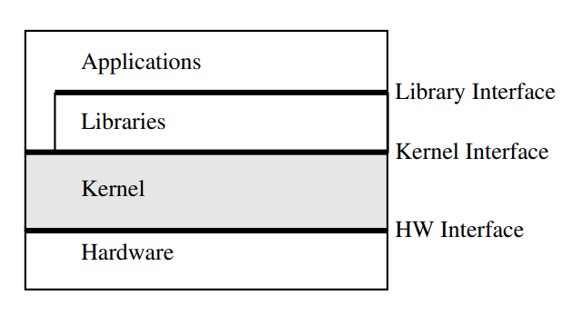

16.2.2022

Úvod atd.

# Operační systém
- Operační systém je **program**, respektive kolekce programů, která **vytváří spojující mezivrstvu mezi HW (který může být virtualizován) a uživateli a jejich procesy**
- obvykle zahrnuje:
    - jádro
    - systémové knihovny a utility
    - textové a/nebo GUI

- přesná definice neexistuje, každý si to vykládá jinak (hlavně společnosti)

#### Cíle OS
- maximální využití zdrojů PC (dříve)
- jednoduchost použití počítačů (dnes převažuje, lidská práce je dnes spíš dražší než PC)

#### Role OS
- Správce prostředků - dovoluje sdílet prostředky efektivně a bezpečně
    - váce procesů sdílí procesor, paměť atd.
- Tvůrce prostředí pro uživatele a jejich aplikační programy
    - vytváří abstrakce (program, proces, soubor), které zjednodušují práci s PC
    - poskytuje stadnadrdní rozhraní zajišťující přenositelnost programů
    - problémem abstrakcí je menší efektivita a nepřístupné některé nízkoúrovňové operace

## Jádro OS
- nejnižší a nejzákladnější část OS
- zavádí se jako první a běží po celou dobu běhu systému (tzv. reaktivní spíše než transformační program)
- navazuje přímo na (virt.) HW a pro uživatele jej zcela zapouzdřuje
- běží v privilegovaném režimu procesoru
    - může provádět libovolné operace na (virt.) HW

#### Jádro (obecně) zajišťuje
- základní správu prostředků a tvorbu základního prostředí jak pro uživatele, tak pro zbytek OS
- zahrnuje všechny operace, kdy je potřeba přímo komunikovat s hardware (přepínání kontextu – jádro, plánování procesů – nekdy v jádru, někdy mimo, zavedení stránky z disku, . . . )
- služby pro zbytek OS a uživatele, některé zajišťuje automaticky
- některé služby nejsou poskytovány automaticky, uživatel/aplikace si o ně musí žádat, nazýváme to volání služeb, tzv. system-call (= systémová volání), která musí být implementována užitím specializovaných instrukcí (Intel: SW přerušení, syscall, sysenter)

#### Rozlišujeme dva typy rozhraní OS
- kernel interface - přímé volání jádra přes instrukci (míň často)
- library interface - volání fcí ze systémových knihoven, které mohou vést na volání služeb jádra

### **Typy jader**

#### *Monolitická jádra*
- vytváří vysokoúrovňové komplexní rozhraní s řadou služeb a abstrakcí, které mohou využívat vyšší vrstvy OS
- všechny subsystémy jsou implementovány v privilegovaném režimu
- všechny procesy, služby... jsou úzce provázány za účelem vysoké efektivity
- nevýhodou je malá flexibilita a bezpečnost
- vylepšením jsou monolitická jádra s modulární strukturou
    - zlešuje se flexibilita

#### *Mikrojádra*
- minimalizují rozsah jádra a rozsah jeho služeb
- jednoduché rozhraní, malý počet abstrakcí
- většina služeb nabízených monolitickými jádry jsou implementována mino jádro v tzv. serverech (neběží v privilegovaném režimu)
- nutnost premptivního plánování, tzn. můžeme nějakému procesu odebrat procesor, když se nám už ten proces nelíbí (např. pomocí přerušení)
- Generace mikrojader:
    1. generace - např. Manch
    2. generace - např. L4, menší režije než 1. generace
    3. generace - např. seL4 nebo ProvenCore, důraz na zabezpečení

#### *Hybridní jádra*
- něco mezi mikrojádry a monolytickými jádry
- založeno na mikrojádrech, rozšířená o kód, který by mohl být implementován ve formě serveru (proces), je ale za účelem menší režije těsněji provázán s mikrojádrem a beží v jeho režimu

### **Přehled technického vybavení**
- procesor:
    - řediš, ALU, registry, instrukce...
- paměť:
    - adresa
    - hierarchie paměti (cache, RAM, disky...)
        - liší se spotřebou, rychlostí, kapacitou...
        - na vrcholu hierarchie jsou registry
        - cache (úrovně L1, L2, L3)
        - RAM
        - disky (SSD, HDD)
        - vyrovnávací paměti disku
        - terciární paměti (zálohy - pásky, CD, DVD, externí disky, cloud...)
- sběrnice:
    - propojují jednotlivé komponenty
    - diskové sběrnice (ATA, SATA, USB, SCSI, SAS)

### **Klasifikace počítačů**
- účel:
    - univerzální
    - specializované (vestavěné, aplikačne orientované, vývojové)
- výkonnost:
    - vestavěné PC, tablety, mobily
    - PC, workstation
    - servery
    - mainframe
    - superpočítače

### **Klasifikace OS**
- účel:
    - univerzální (UNIX, Linux, Windows...)
    - specializované
- počet uživatelů:
    - jednouživatelské
    - víceuživatelské
- počet současně běžících úloh:
    - jednoúlohové
    - víceúlohové

### **Implementace OS**
- těžko se ladí a programují, protože to jsou gigantické projekty, paralelní a asynchronní systémy, systémy závislé na technickém vybavení

Důsledky:
- setrvačnost při implementaci (neměnit kód, který pracuje spolehlivě)
- používání technik pro minimalizaci výskytu chyb (inspekce zdrojového kódu, rozsáhlé testování...)