# Správa paměti

- aby program mohl být proveden, musí nad ním být vytvořen procecs, musí mu být přidělen procesor a musí mu být přidělena paměť (a případně další zdroje)
- rozlišujeme:
    - logický adresový prostor (LAP): virtuální adresový prostor se kterým pracuje procesor při provádění kódu (každý proces i jádro má svůj)
        - má hezký spojitý adresový prostor s číslováním od 1....n
    - fyzický adresový prostor (FAP) - adresový prostor fyzických adres paměti (společný pro všechny procesy i jádro)
        - rozházeno, actual hard disk

- MMU (Memory management unit) - HW jednotka pro překlad logickýchadres na fyzické, běžně součást čipu procesoru

    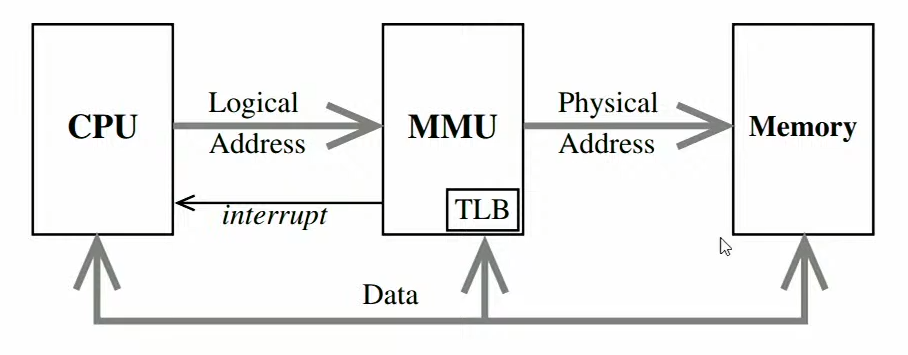
    
    - proces přidělování paměti

- MMU využívá speciálních registrů a případně i hlavní paměti systému

## Přidělování paměti
- na nejnižší úrovni z hlediska blízkosti k HW se můžeme v jádře setkat s přidělování FAP pro zamapování do LAP

    - spojití bloky
    - segmenty
    - stránky (asi nejpoužívanější dnes)
    - kombinace výše uvedeného
- na vyšší úrovni se pak používá přidělování LAP pro konkrétní potřeby uživatelských procesů (malloc... - implementováno mimo režim jádra) i pro běžnou potřebu v jádře (kmalloc, vmalloc...) a to v rámci bloků LAP již zamapovaných do přidělených úseků FAP

### Spojité bloky
- procesům jsou přidělovány spojité bloky určité velikosti
- výhody: jednoduchost při režii
    - snadná implementace
    - udržujeme jen dvě informace o paměti - adresu paměti a její velikost

    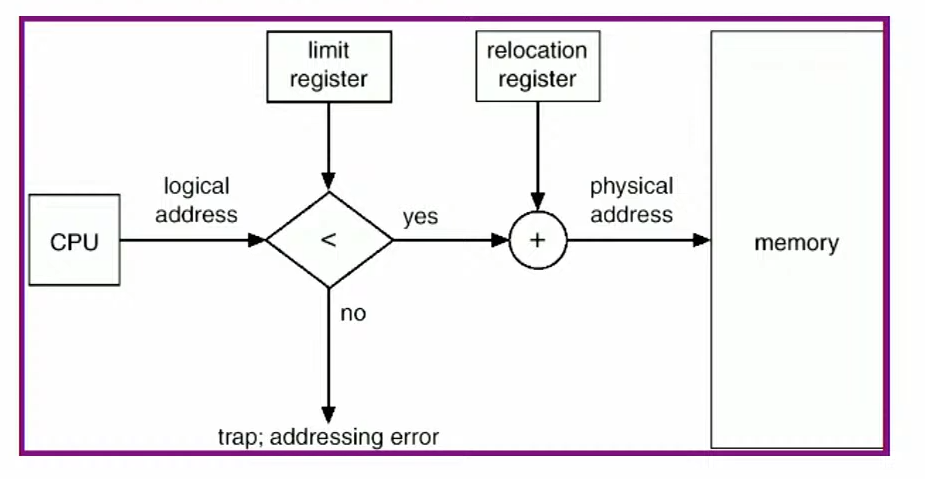

- problémy:
- významně se projevuje externí fragmentace
    - přidělováním a uvolňováním paměti dochází k tvorbě nevyužitelných bloků (moc malé)
    - problém se zvětšování přiděleného prostoru
    - dynamická reorganizace paměti je nákladná
    - minimalizace pomocí různých strategií alokace paměti - mimo *first fit* můžeme používat třeba *best fit*, *worst fit*, *binary buddy (přidělují se kousky paměti o velikosti násobku dvou)...*
- při nedostatku paměti je nutné odkládat na disk veškerou paměť procesu: může být zbytečné, pomalé
- není možné jemně řídit přístupová práva, není možné sdílet části paměti
- používá se pouze ve speciálních případech

### Segmentace paměti
- něco mezi spojitými bloky a stránkováním
- LAP je rozdělen na kolekci segmentů
- různé segmenty můžou být různé velikosti
- mohou být přiděleny překladačem v době překladu (v asm ručně xd) jednotlivým částem procesu
- každy segment má číslo a velikost, logická adresa sestává z čísla segmentu a posuvu v něm

    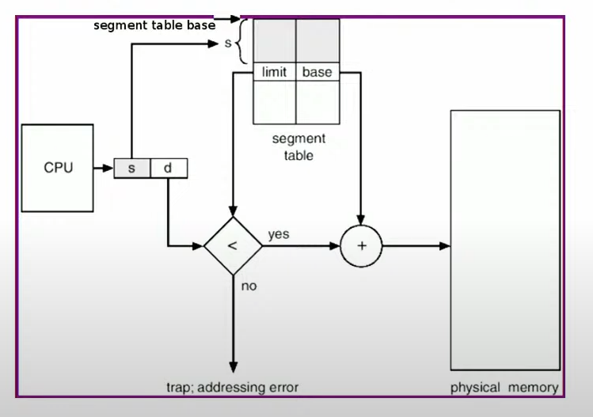

- segmenty se můžou používat jako jednotka ochrany, odkládání a/nebo sdílení paměti
- implementace je stále docela jednoduchá
- paměť je přidělována po segmentech - zmírnění dopadů externí fragmentace a jeměnší odkládání než u přidělování jediné oblasti - ale problém přetrváná
- jemnější řízení přístipu a sdílení
- segmentace je viditelná procesu: komplikace při překladu, možnost chyb

### Stránkování
- LAP je rozdělen na jednotky pevné velikosti: stránky (pages)
- FAP rozdělen na jednotky stejné velikosti: rámce (frames)
- vlastnosti:
    - paměť je přidělována po rámcích
    - neviditelné uživatelské proecsy
    - minimalizovány proglémy s externí fragmentací:
        - nevzniká nevyužitelný volný prostor
        - možné snížení rychlosti přístupu do paměti a alokace/dealokace
        - proto je v praxi snaha přidělovat paměť pokud možno po spojitých posloupnostech rámců, např. pomocí binary buddy
    - jemná jednotka ochrany (r/rw, user/sytem, možnost provádění - tzv. NX bit)
    - jemná kontrola odkládání po stránkách
    - složitější implementace, větší režie
    - interní fragmentace

1. verze
- v nejjednodušším případě tzv. jednoduchých (či jednoúrovňových) tabulek stránek, OS udržuje informaci o volných rámcích a pro každý proces (a jádro) tabulku stránek (page table)

    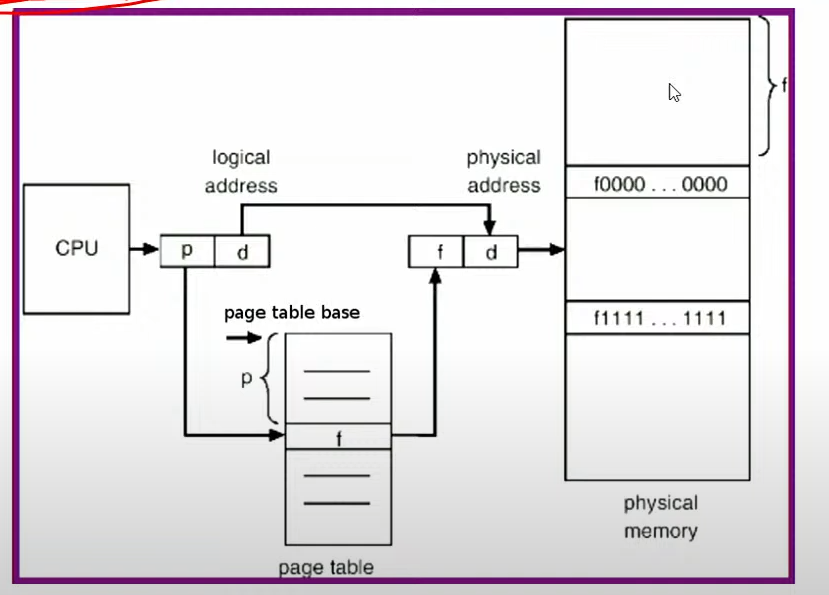

- tabulka stránek obsahuje popis mapování logických stránek do FAP a příznaky platnosti mapování, přístupu, modiikace, přístupová práva, příznak globality...
- tabulky stránek jsou udržovány v hlavní paměti
- každý odkaz na data / instrukce v paměti vyžaduje (u jednoduché tabulky stránek); dva přístupy do paměti: do tabulky stránek a na vlastní data / instrukci
- urychlení pomocí HW asociativní vyrovnávací paměti TLB (Translation Look-aside Buffer)

2. verze
- TLB obsahuje dvojice (číslo stránky, číslo rámce) + některé z příznaků spojených s daným mapováním v tabulkách stránek (přístupová oprávnění, příznak modifikace, příp. další)
- POZOR - v TLB nejsou celé stránky nebo rámce
- TLB se prohledává paralelně na základě čísla stránky a to buď plně (viz. obrázek níže), nebo částečně (dojde k indexaci skupiny buněk TLB dle části čísla stránky a pak k paralelnímu dohledání - např. by mohly být užity 2 bity z čísla stránky k rozlišení 4 množin dvojic stránek prohledávaných již tak, jak je znázorněno níže)

    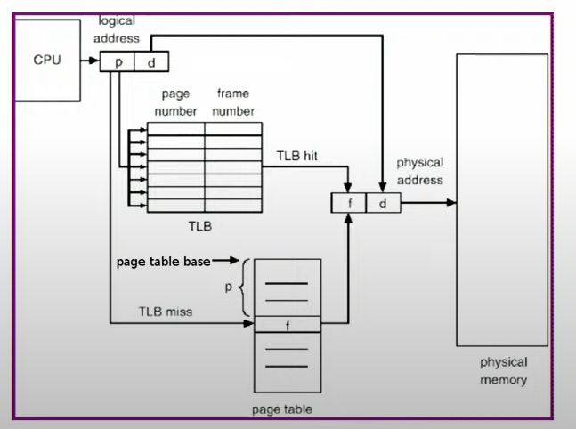

- POZOR - k TLB miss může najít vícenásobně (nezarovnaná instrukce, nezarovnaná data, data delší než jedna stránky...)
- po TLB miss:
    - u HW řízených TLB HW automaticky hledá v tabulce stránek
    - u SW řízených TLB musí v tabulce stránek hledat jádro a patřičně upravit obsah TLB
- někdy může být použito více TLB
- při přepnutí kontextu nutno obsah TLB invalidovat. Optimalizace:
    - použití globálních stránek označených zláštním příznakem v tablukce stránek
    - spojení záznamu v TLB s identifikací procesu
- invalidace TLB je nutná i po změně obsahu stránek
- některé procesory mohou dopředu nahrávat do TLB překlad pro odhadované dále prováděné instrukce
- efektivnost stránkování právě velmi silně závisí na úspěšnosti TLB

    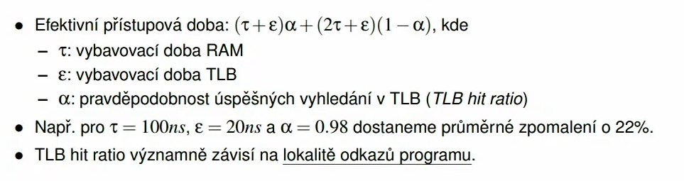

- Lokalita odkazů - vlastnost programu - míra toho, kolik různých shluků adres (odpovídajících typicky adresám v různých stránkách) bude proces potřebovat v krátkém časovém úseku
    - sem se kouknout na přednášku kdyžtak

    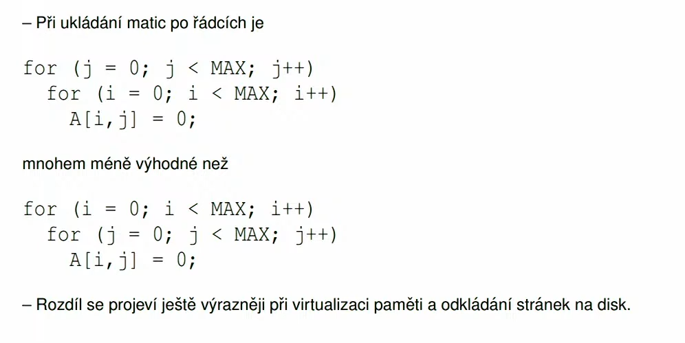

### Implementace tabulek stránek
- tabulky stránek můžou být značně rozsáhlé

    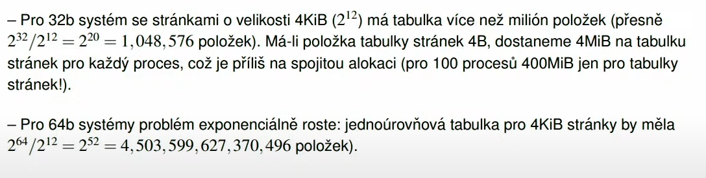

**Hierarchické tabulky stránek**
- tabulka stránek je sama stránkována, vznikají tabulky tabulek stránek (toto ale dále zpomaluje přístup)

    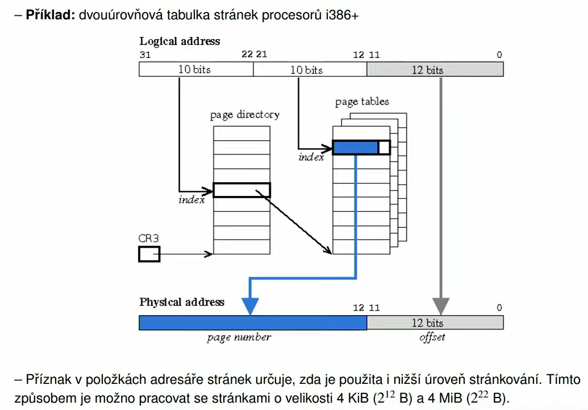

- na x64 se teď používá pouze 48b, do budoucna možnost rozšíření na 52b

    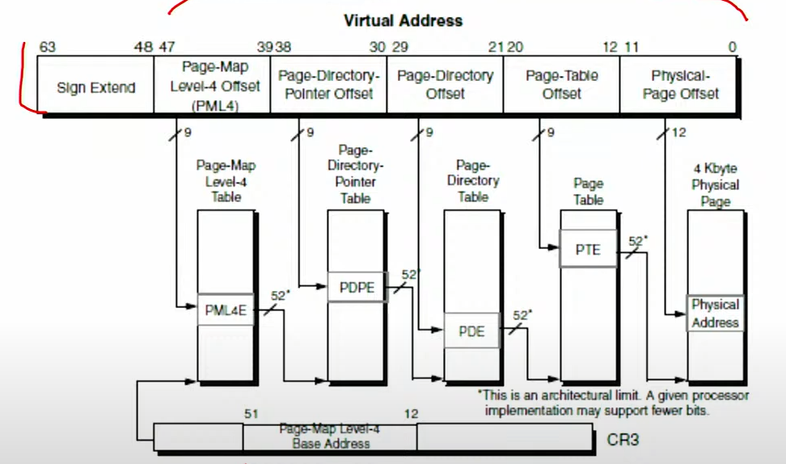

    - spodních 12 bitů je offset do rámců i stránek (oboje 4kB)
    - poté 4 odkazy do tabulek 1. - 4. úrovně (každý odkaz 9b)
    - zbytek do 64b by měly být rozkopírovány znaménkové bity (prakticky buď jen 0 nebo 1)
    - na všech úrovních se provádí kontrola mapování, všechny musí být samozřejmě platné
    - zpomalení o 400%, o to větší důraz na TLB
    - někdy se používají i nižší úrovně stránkování, to se pak prakticky pracuje se stránkami o velikosti 4KiB, 2MiB nebo 1GiB

- větší velikost, složitější organizace - více úrovní, oddělení TLB pro překlad adres dat a kódu

- další optimalizace práce s TLB:
    - globální stránky
    - vstupy TLB spojené s identifikátory procesů
    - spekulativní dopředné nahrávání překladu do TLB
    - využití specializovaných cache
- zanořené hierarchické tabulky stránek

**Hashované hierarchické tabulky stránek**
- v překladových položkách ve zřetězeném seznamu může a nemusí být celé číslo stránky (nemusí tam být celé, pokud hash funkce některé bity čísla stránky spolehlivě odliší - např. pokud nikdy nebudou kolidovat čísla stránek s odlišnými n dolními bity)

    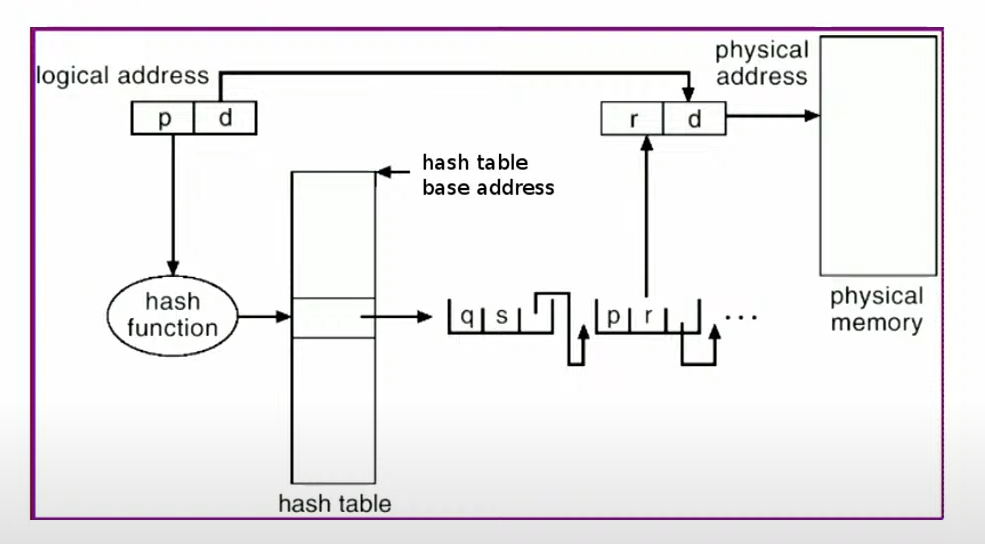

- obecný zřetězený seznam překladových položek se stejnou hodnotou hash funkce může být nahrazen fixním počtem překladových položek ukládaných pro danou hodnotu hash funkce
    - v takovém případě se pak musí nějak vyhazovat jeden záznam i guess
- hashovaná tabulka může být sdílená všemi procesy (čímž se blíží invertované tabulce stránek, o které se bavíme dále; ale nemá jeden řádek pro každý rámec)
    - v takovém případě se v překladových položkách mimo čísla stránky a čísla rámce uržuje i číslo procesu (pro který proces se hledá)

**Invertovaná tabulka stránek**
- jediná tabulka udávající pro každý rámec, který proces má do něj namapovánu kterou stránku
- mapuje se přes rámce a ne přes stránky (jako jediná)

    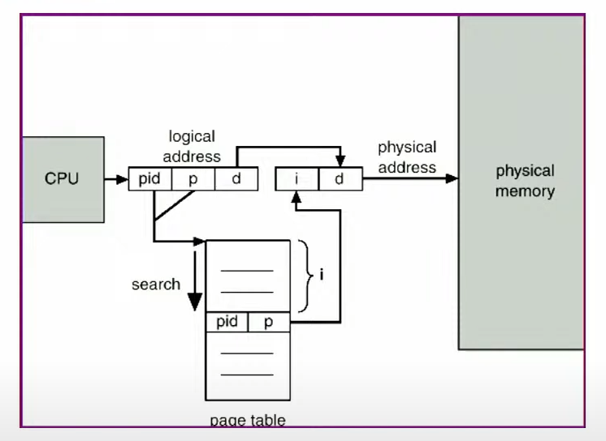

- výhodou je, že každý rámec mám jenom jednou a jejich počet odpovídá velikosti fyzického disku
- tabulka rámců bude vždy jen jedna
- nevýhodou je, že se dají stránky v tabulce rámců prohledávat pouze cyklem (strašlivě neefektivní)
    - takže se nejčastěji používá kombinace hashování a invertované tabulky

## Stránkování a segmentace na žádost
- Virtualizace paměti umožňuje procesům (a jádru) pracovat s oddělenými spojitými logickými adresovými prostory, i když odpovídající fyzický adresový prostor může být fragmentován
- v okamžiku, kdy je zaplněna fyzická paměť (RAM), tak se provádí to stránkování na žádost (vždycky když přepneme kontext procesu tak jeho paměť uložíme na pevný disk a do RAM nahrajeme paměť procesu, který se spouští)
- ne všechno v LAP musí být ve FAP
- pak hovoříme o:
    - stránkování na žádost
    - segmentování na žádost
- výhodou je menší spotřeba fyzické primární paměti, rychlejší odkládání na disk a zavádění do paměti
- pro uložení části LAP, které aktuálně nejsou ve FAP, se využívá prostor na disku
- z disku se příslušné části LAP zavádí do FAP pouze tehdy, je-li to zapotřebí

### Stránkování na žádost
- stránky jsou zaváděny do paměti pouze tehdy, když jsou potřeba
- informace o odložených stránkách si jádro vede ve svých pomoných strukturách - nejsou uloženy v tabulkách stránek, se kterými pracuje MMU!
- stránka je potřeby tehdy, dojde-li k odkazu na ni. V jedno či více úrovňové tabulce stránek je příznak, zda je příslušné stránce nastaven rámec; pokud ne, tak dojde k **výpadku stránky (page fault)**
- výpadek stránky je HW přerušení od MMU které říká, že nelze převést adresu (adresa není definována v tabulce stránek)

### Obsluha výpadku stránky
1. Kontrola, zda se proces neodkazuje mimo přidělený adresový prostor
2. Alokace rámce:
    - použijeme volný rámec, pokud nějaký volný je
    - pokud není:
        - vybereme vhodnou stránku s přiděleným rámcem (victim page)
        - byla-li stránka změněna, což udává příznak modifikae v tab. stránek, je odložena na swap
        - použijeme uvolněný rámec
3. Inicializace stránky po alokaci závislá na předchozím stavu stránky:
    - první odkaz na stránku:
        - kód: načtení z progamu
        - inicializovaná data: načtení z programu
        - vše ostatní: vynulování (nelze ponechat původní obsah, kvůli bezpečnosti)
    - stránka byla v minulosti uvolněna z FAP.
        - kód: znovu načte z programu (jen pokud nelze přepisovat kódové stránky)
        - konstantní data: totéž co kód
        - ostatní: pokud byla modifikována, je stránka ve swapu a musí se načíst zpět do FAP, jinak je obsah vynulován
4. Úprava tabulky stránek: namapování zpřístupńované stránky na přidělený rámec
5. Proces je připraven k opakování instrukce, která výpadek způsobila (je ve stavu "ready")

### Výkonnost stránkování na žádost
- T << D, takže p musí být co nejmenší:

    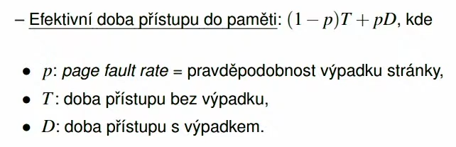

- dostatek paměti a jemu přiměřený počet procesů (s ohledem na jejich paměťové nároky)
- vhodný výběr zaváděných a odkládaných stránek
- lokalita odkazů v procesech - chceme, aby poces pracoval s co nejmenším úsekem paměti, když moc skáče tak musí hodně načítat a způsobuje hodně výpadků

### Počet výpadků
- k výpadkům může dojít:
    - při čtení instrukce
    - při práci s operandy
    - u instrukce i u operandů může dojít k výpadkům i vícenásobně
- vícenásobné výpadky:
    - nezarovnání instrukce
    - nezarovnání dat
    - data jsou delší než jedna stránka
    - výpadky tabulek stránek různých úrovní (příklad v prezentaci, na streamu)

### Odkládání stránek
- k odložení stránky může dojít při výpadku stránky
- může být provedeno odložení:
    - lokální - v rámci procesu, u kterého došlo k výpadku
        - je zapotřebí vhodný algoritmus alokace rámců pro použití procesyy
        - neměníme počet bloků, které má proces alokován
    - globální - bez ohledu na to kterému procesu patří která stránka
- typicky je neustále uržován určitý volný počet rámců
- pokud počet volných rámců klesne pod určitou mez, aktivuje se tzv. **page daemon (zloděj stránek)**, který běží tak dlouho, dokud neuvolní odstatečný počet stránek
- při výpadku stránky se pak použije rámec z množiny volných rámců
- protože ukládání na disk je pomalé, tak většinou zloděj běží paralelně s ostatními procesy
- často se doplňuje heuristikou, která potom co se vybere kandidát na uvolnění, tak se tento kandidát ještě chvíli sleduje, zda jsme opravdu vybrali správně

### Algoritmy výběru odkládání stránek

**FIFO**
- first in first out
- pamatujeme si, kdy byly rámce zavedeny do paměti
- odstraňuje stránku, která byla do paměti zavedena před nejdelší dobou a dosud nebyla odstraněna
- jednoduchá implememntace
- problémy:
    - může odstranit tzv. starou, ale stále často používanou stránku
- trpí tzv. Beladyho anomálií - více výpadků při zvětšení paměti

    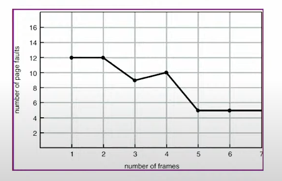

- můžeme ho použít v kombinaci s přemístěním uvolněného rámce do množiny volných rámců, přidělením jiného volného rámce a možností ihned získat zpět právě uvolněný rámec při následném výpadku signalizujícím, že byla zvolena nesprávná oběť

**LRU (Least Recently Used)**
- odkládá nejdéle nepoužitou stránku
    - POZOR, ne stránku použitou před nejdelší dobou, proože bysme jinak prakticky mohli smazat první stránku xd
- velmi dobrá aproximace hypotetického ideálního algoritmu (tj. algoritmu, který by znal budoucnost a podle budoucích požadavků rozhodoval, co aktuálně odložit tak, aby počet výpadků byl v budoucnu minimální)
    - někdy nastávají problémy s cyklickými průchody rozsáhlými poli, spolu se snahou takové přístupy detekovat a řešit zvlášť např. strategií odstranění naposledy použité stránky (moset recently used - MRU)
- problematická implementace vyžadující výraznou podporu HW
- používají se aproximace LRU

**Aproximace LRU s využitím omezené historie referenčního bitu stránek**
- referenční bit nám říká, že jsme se do této stránky odkazovali (whatever the fuct this means)
- ref. bit stránky je HW nastaven při každém přístupu
- jádro udržuje bitové vektory ukládající omezenou historii tohoto bitu pro jednotlivé stránky
- periodicky posová obsah historie doprava
- na nejlevější pozici uloží aktuální hodnotu ref. bitu a vynuluje ho
- oběť je vybrána jako stránka s nejnižší číselnou hodnotou historie
    - ukládáme-li 4 bity historie a máme stránky s historií 0110 a 1100, odstraníme první z nich (nejlevější bit je poslední reference)

**Aproximace LRU algoritmem druhé šance**
- stránky v kruhovém seznamu, postupujeme a nulujeme referenční bit, odstraníme první stránku, která již nulový referenční bit má
- často používaný algoritmus (též označovaný jako tzv. clock algorithm)

    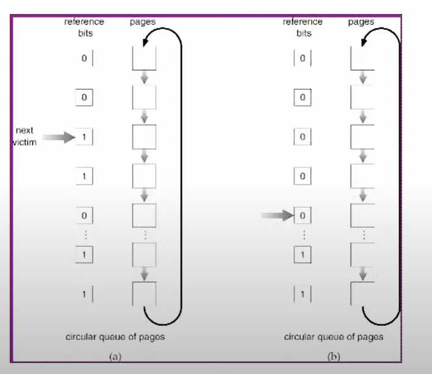

*Modifikace algoritmu druhé šance*
- upřednostnění nemodifikovaných stránek jako obětí (modifikované se zapíší na disk a dostanou další šanci)
- dva ukazatele procházející frontou s určitým rozestupem - jeden nuluje referenční bit, druhý odstraňuje oběti (tzv. double-handed clock algorithm)

    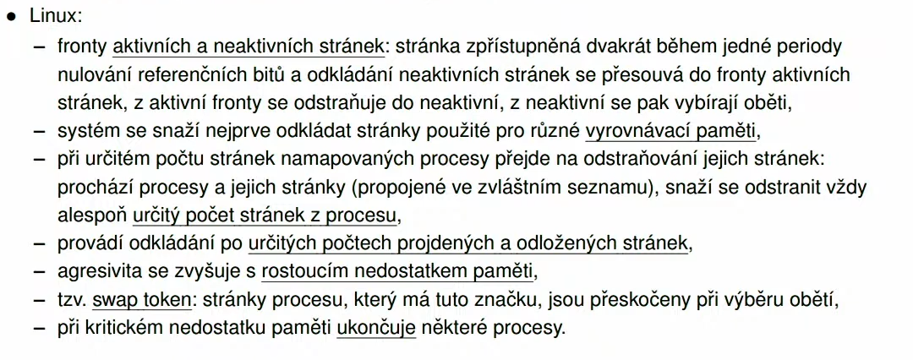

### Alokace rámců procesům (resp. jádru)
- přidělování rámců procesům (resp. jádru) je významné zejména při lokálním výběru obětí, kde řídí přidělení množiny rámců, v rámci kterých se pak provádí lokální výměny
- u globálního výběru lze použít pro řízení výběru obětí
- je třeba mít vždy přidělen minimální počet rámců pro provedení jedné instrukce, jinak dojde k nekončnému vyměňování stránek potřebných k provedení instrukce
- dále se používají různé heuristiky pro určení počtu rámců pro procesy (resp. jádro):
    - úměrně velikosti programu, proiritě, objemu fyzické paměti...
    - na základě pracovní množiny stránek (stránky, se kterými proces pracuje), tj. množiny stránek použitých procesem (resp. jádrem) za určitou dobu (aproximace s pomocí referenčního bitu)
    - přímo na základě sledování frekvence výpadků v jednotlivých procesech

### Trashing
- nastává když běží hodně procesů v systému
- znamená to, že proces (v horším případě systém) stráví více času náhradou stránek než užitečným výpočtem

    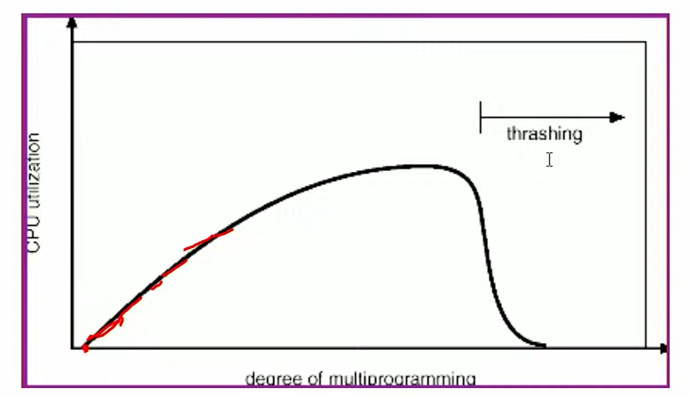

- při vážném nedostatku paměti swapper (je-li v systému implementován) pozastaví některé procesy a odloží jejich veškerou paměť
- jinou možností je ukončení některých procesů (zase otázka které procesy se mají ukončit)

### Poznámky nakonec
- propaging - snaha zavádět do systému více stránek současně (zejména při startu procesu či po odswapování)
    - např. spustím program a rovnou nahraju celý jeho zdrojový kód, nebo i více programů (procesů) současně
- zamykání stránek
    - zabraňuje odložení
    - užívá se např.
        - u stránek, do nichž probíhá I/O
        - u (částí) tabulek stránek
        - u (některých) stránek jádra
        - na přání uživatele - volání *mlock()*
            - v rámci přednastavených limitů a oprávnění

## Sdílení stránek
- stránkování umožňuje jemnou kontrolu sdílení paměti
- Sdílení stránek:
    - kód programů (procesy řízené stejným programem, sdílené knihovny)
    - konstantní data nebo dosud nemodifikovaná data u kopií procesů (technologie copy-on-write)
    - mechanismus IPC
    - sdílení paměťově mapovaných souborů
- díky tomu máme mnohem lepší využitelnost fyzické paměti

### Sdílené knihovny
- sdílené knihovny (.dll, .so, .dylib) - můžoou být pouze jednou v paměti, procesy si je sdílí
- výhody:
    - menší programy - lepší využití FAP i diskového prostoru, možnost aktualizovat knihovny
- nevýhody:
    - závislost prograamů na dalších souborech a verzích knihoven
    - možný pomalejší start programu (je nutné dynamicky sestavit, ale zase se může ušetřit díky nutnosti nezavádět již zavedené stránky)
    - možné pomalejší volání (nepřímé volání přes sestavovací tabulky; je možno ale ušetřit díky lepší lokalitě paměti - méně výpadků, lepší využití cache)

### Copy-on-write
- technika práce s pamětí, kdy se sdílejí nějaké stránky mezi procesy, ale v případě že do té stránky zapíšeme, tak se udělá kopie pro ten daný proces
- pří spuštění procesu pomocí *fork* se nevytvoří kopie veškeré paměti procesu
- vytvoří se pouze tabulky stránek a stránky se poznačí jako copy-on-write
- k vytvoření fyzické kopie dojde až při pokusu o zápis jedním z procesů
- poznámka: *vfork* - alternativa k *fork*, kde je paměť skutečně sdílena

### Paměťově mapované soubory
- bloky souborů jsou mapovány do stránek paměti
- soubory jsou stránkováním na žádost načteny po stránkách do paměti a díle může být práce se soubory realizována standardním přístupem do paměti namísto použití *read()/write()*
- umožňuje sdílený přístup k souborům
- komplikovanější programování

    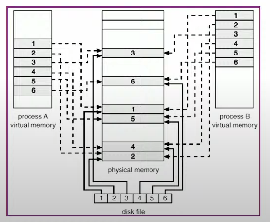

- dostupné přes *mmap()*

### Paměťové regiony
- máme region pro zásobník, inicializovaná data, kód...
- často bývají čistě abstraktní (implementovány čistě v jádře)
- jedná se o spojité oblasti virtuální paměti použité za určitým účelem
- každý proces může mít tabulku regionů procesu udávající pozici v regionu v LAP procesu, přístupová práva k regionu...
- v systémové tabulce regionů je uvedena velikost regionu, typ, i-uzel souboru případně mapovaného do regionu apod.

    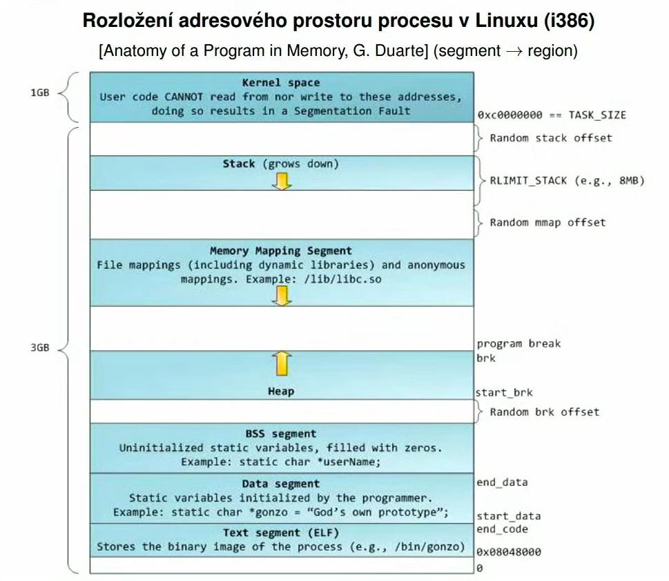

A nyní konec, teď farma na zkoušku, GL pokdu to někdo čte :)