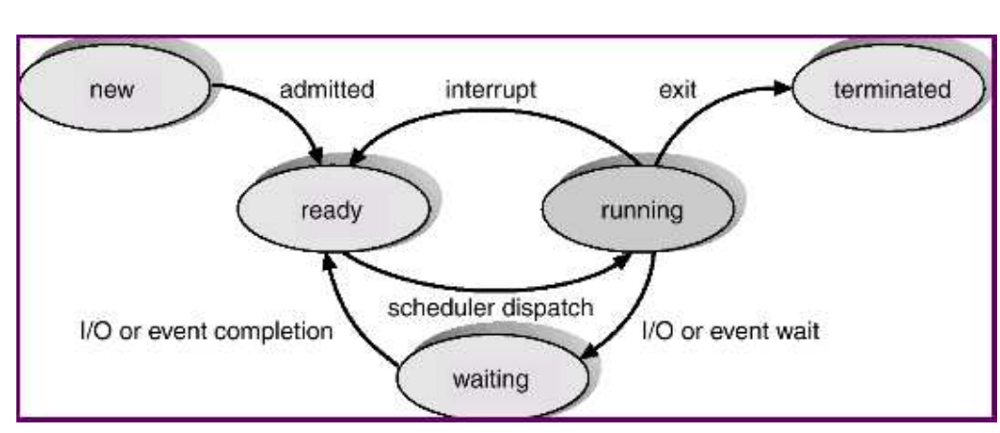
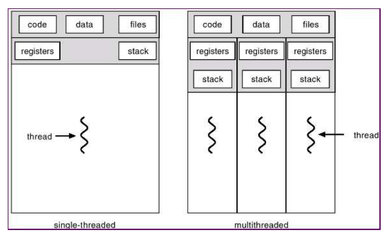
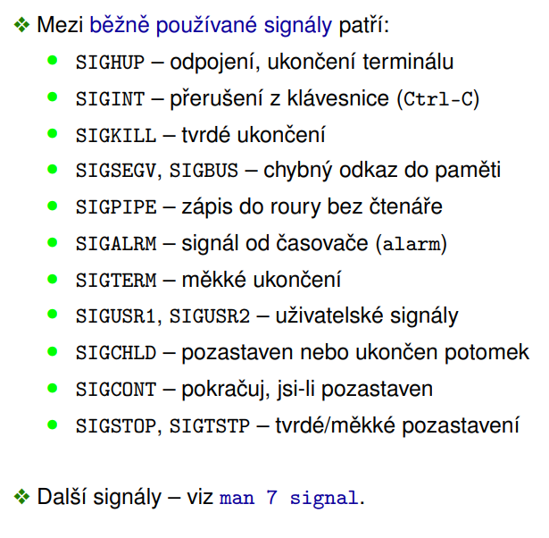
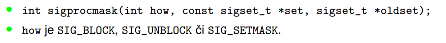
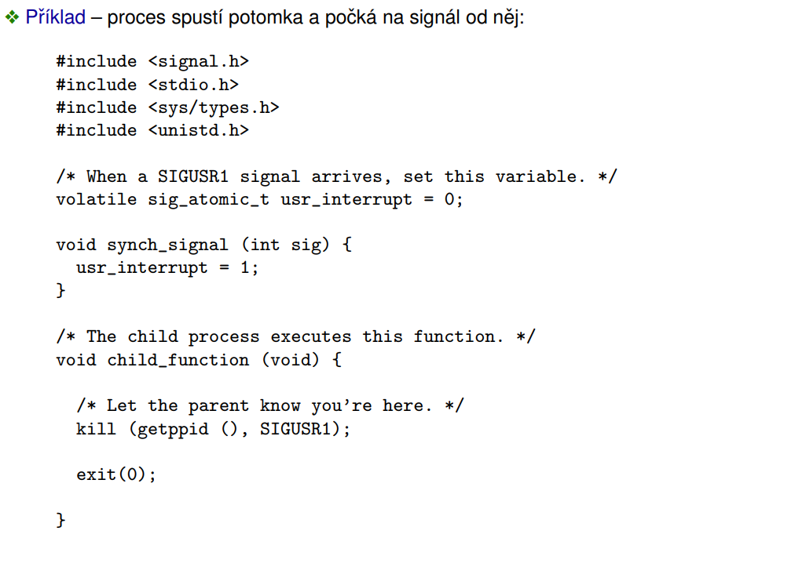
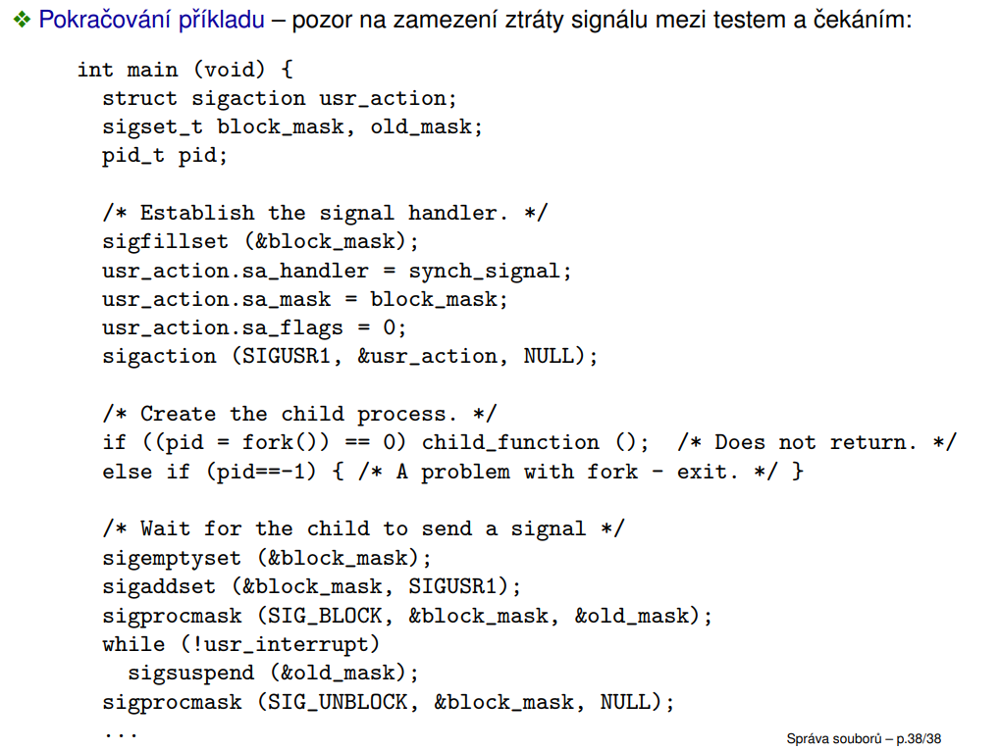

30.3.2022

# Procesy - správa procesů

- zahrnuje:
    - přepínání kontextu (dispatcher) - fyzické odebírání a přidělování procesoru na základě rozhodnutí plánovače
    - plánovač (scheduler) - rozhoduje, který proces poběží na procesoru, jak dlouho...
    - správu paměti (memory management) - přiděluje paměť, procesy by si neměly navzájem šahat do paměti
    - podporu meziprocesové komunikace (IPC) - signály, RPC... (tohle je hlavní část 2. projektu)

## Proces
- běžící program (program je sekvence příkazů)
- proces je v OS definován:
    - identifikátorem (PID)
    - stavem jeho plánování
    - programem, kterým je řízen
    - obsahem registrů (včetně EIP a ESP apd.)
    - zásobníkem - rozpracované funkce
    - daty - statická inicializovaná a neinicializovaná data, hromada, individuálně alokované úseky paměti
    - využitím dalších zdrojů OS a vazbami na další objekty OS, otevřené soubory, signály, PPID, UID, GID, semafory, sdílená paměť, sdílené knihovny...

### Stavy plánování a jejich změny
- běžně se rozlišují následující stavy procesů

    

- new - první fáze tvorby procesu, ještě proces nemůže běžet
- ready - je schopen běžet, ale ještě neběží
- running - poté co ho plánovač naplánuje tak se někdy dostane na procesor a běží, může přejít do několika stavů:
    - terminated - nejjednodušší, ukončení procesu, ještě furt zůstává v systému ale jen čeká až si někdo převezme jeho návratovou hodnotu
    - ready - přesune se zpět poté pomocí interrupt (nebo se může sám proces vzdát procesoru), co procesor usoudí že běžel dlouho nebo tak
    - waiting - čeká na něco, např. na načtení dat z disku, během tohoto stavů procesu může na procesoru běžet něco jiného, z tohoto stavu se dostaneme až doběhne ten proces na který čekal, přejde do stavu ready

**Stavy plánování procesu v UNIXu**

- trochu jinak napsaný to co je výš; mátoha = zombified

    

### PCB - Process Control Block
- proces bývá v OS reprezentován strukturou PCB (Process Control Block)
- PCB zahrnuje:
    - indentifikátory spojené s procesem (identifikátor procesu, identifikátor rodiče procesu, identifikátor uživatele)
    - stav plánování procesu
    - obsah registrů (jen když není ve stavu running)
    - plánovací informace (priorita, ukazatele na plánovací fronty...)
    - informace spojené se správou paměti (tabulky stránek...)
    - informace spojené s účtováním (spotřeba procesoru...)
    - využití I/O zrojů (otevřené soubory, používaná zařízení...)
- PCB se někdy rozděluje do několika dílčích struktur

### Části procesu v paměti UNIXu
- uživatelský prostor (user adress space) přístupný procesu:
    - to co normálně vidíme
    - kód (code area/text segment)
    - data (incializovaná/neinicializovaná data, hromada, individuálně alokovaná paměť)
    - zásobník
    - soukromá data sdílených knihoven, sdílené knihovny, sdílená paměť
- uživatelská oblast (user area) - ne vždy použita:
    - uložena zvlášť pro každý prces spolu s daty, kódem a zásobníkem v user adress space příslušného procesu (s nímž může být odložena na disk)
    - je ale přístupná pouze jádru
    - obsahuje část PCB, která je používána zejména za běhu procesu
        - PID (id procesu), PPID (id rodiče procesu), UID (id uživatele), EID, GID, EGID
        - obsah registrů
        - diskriptory souborů
        - obslužné funkce signálů
        - účtování (spotřebovaný čas CPU...)
        - pracovní a kořenový adresář...
- záznam v tabulce procesů (process table)
    - uložen trvale v jádru
    - obsahuje zejména info o procesu
        - PID, PPID, UID...
        - stav plánování
        - událost na kterou se čeká
        - plánovací informace (priorita, spotřeba času...)
        - čekající signály
        - odkaz na tabulku paměťových regionů procesu
- tabulka paměťových regionů v procesu (per-process region table) - popis paměťových regionů rocesu (spojitá oblast virtuální paměti použitá za určitým účelem: data, kód, zásobník, sdílená paměť) + příslušné položky tabulky regionů, tabulka stránek
- zásobník jádra - speciální zásobník v adresovém prostoru procesu, který není dostupný tomu samotnému procesu, který se používá když chceme volat nějakou službu jádra tak se tato služba prování na tomto zásobníku, protože většinou nechceme tuto službu volat do stejného zásobníku kde je proces (malá velikost zásobníku)

### Kontext procesu
- kontext procesu = stav procesu
- rozlišujeme:
    - uživatelský kontext - kód, data, zásobník, sdílená data
    - registrový kontext
    - systémový kontext - uživatelská oblast, položka tabulky procesů...

### Systémová volání nad procesy v UNIXu
- několik skupin:
    - fork, exec, exit, wait, waitpid
    - kill, signal
    - getpid, getppid
- identifikátory spojené s procesy v UNIXu
    - identifikace procesu PID
    - identifikace rodiče PPID
    - reálný (skutečný) uživatel, skupina uživatelů UID, GID
    - efektivní uživatel, skupina uživatelů EUID, EGID - např. když chci spustit soubor, který může spouštět pouze root, tak root k tomu souboru nastaví jako efektivní svoje UID; pak vidím že se to spustilo s efektivními právy root ale s reálné UID tam bude moje jakožto normálního uživatele
    - v Linuxu navíc FSUID a FSGID (pro přístup k souborům se zvýšenými privilegii)
    - skupina procesů (např. kolona/roura) a sezení, do kterých proces patří - PGID, SID

### Vytváření procesů - fork
- služba *fork*
- tato služba duplikuje proces na takřka identického potomka
- *fork* se zavolá jednou, ale vrátí se z něho dvakrát (jeden return je ten původní proces a druhý ten nový, každý jde svou větví)
- dědí se:
    - řídící kód, data, zásobník, sdílená paměť, otevřené soubory, obsluha signálů, většina synchronizačních procesů...
        - pro efektivitu se používá práse s pamětí copy-on-write
- liší se:
    - návratový kód *fork* (potomek = 0, rodič = PID nového procesu), identifikátory, údaje spojené s plánováním a účtováním, nedědí čekající signály, souborové zámky a některé další specializované zdroje a nastavení
- vzniká vztah rodič-potomek (parent-child) a hierarchie procesů

    

### Hiearchie procesů v UNIXu
- předkem všech uživatelských procesů je init s PID = 1
- pokud procesu skončí předek, jeho předkem se automaticky stane init, který později převezme jejich návratový kód (proces jinak nemůže definitivně skončit a jako zombie čeká až bude mít komu odevzdat návratový kód)
- výpis stromu procesů např. pomocí *pstree*
- existují i procesy jádra (kernel processes/threads), jejich předkem není init
    - jejich kód je součástí jádra, běží v režimu jádra
    - vyskytuje se i proces s PID = 0 s různými rolemi: podíl na inicializaci jádra, následně se z toho stane swapper (FreeBSD), nebo idle smyčka (Linux, nevypisuje se)
    - na Linuxu existuje proces jádra kthreadd - spouští ostatní procesy jádra a je jejich předkem
    - vztahy mezi procesy jádra nejsou příliš významné a mohou se lišit

### Změna programu - exec
- čassto se používá dohromady s *fork* (a fork zase s tímto)
- příkaz *execve* - základní volání
- execl, execlp, execle, execv, execvp
- *execl("/bin/ls", "ls", "-l", NULL);*
    - spouštěný program a jeho argumenty odpovídající $0/argv[0], $1/argv[1]
- prakticky to říká nahraď spuštěný program za jiný
- vrací hodnotu jen když dojde k chybě (-1), jinak nevrací nic
- procesu zůstává řada zdrojů a vazeb v OS (identifikátory, otevřené soubory...), zanikají vazby a zdroje vázané na původní řídící kód (obslužné funkce signálů, sdílená paměť, paměťově mapované soubory, semafory)
- Windows - CreateProcess(...) - zahrnuje funkčnost *fork* i *exec*

### Čekání na potomka - wait, waitpid
- *wait* - systémové volání, umožňuje pasivní čekání na potomka
    - vrací PID ukončeného procesu (nebo -1: příchod signálu, neexistující potomek)
    - přes argument zpřístupňuje návratový kód potomka
    - pokud nějaký potomek je již ukončen a čeká na předání návratového kódu, končí okamžitě
- *waitpid* - obecnější systémové volání
    - umožňuje čekat na určitého potomka či potomka z určité skupiny
    - umožňuje čekat i na pozastavení či probuzení z pozastavení příjmem signálu
        - můžeme detekovat že někdo potomka pozastavil a také že se potomek zase rozjel

### Start systému
- probíhá v několika krocích
1. Firmware (BIOS/UEFI) - zjišťuje jestli je např. připojena paměť, jestli má cenu něco zavádět, odkud atd. atd.
2. Načtení a spuštění zavaděče OS, někdy v několika fázích (např. BIOS využívá kód v MBR [Master Boot Record] a následně v dalších částech disku)
3. načtení jádra, spuštění jeho inicializačních funkcí
4. Inicializační funkce jádra mj. vytvoří proces jádra 0, ten vytvoří případné další procesy jádra a proces *init*
5. *init (systemd)* - načítá inicializační konfigurace a spouští další procesy
    - v určitém okamžiku se spustí *gdm / sddm / lightdm /...* - toto zařizuje přihlášení v grafickém režimu
    - na konzolích spustí *getty* - umožňuje zadat přihlašovací jméno a změní se na *login* - načte heslo a změní se na shell, ze kterého se spouští další procesy
    - *init* i nadále běží, přebírá návratové kódy procesů, jejichž rodič již skončil, řeší případnou reinicializaci systému či jeho částí

### Úrovně běhu
- systém úrovní běhu - cca 6 úrovní spuštění systému (0=halt, 1=single user, 6=reboot...)
- změna úrovně běhu - *telinit N*
- konfigurace:
    - adresáře */etc/rcX.d* obsahují normální skripty spouštěné při vstupu do určité úrovně; spouští se v pořadí daném jejich jmény, skripty se jménem začínajícím K s argumentem *stop*, skripty jsménem začínajícím S s parametrem *start*
    - tuto implementaci lze spouštět i ručně
- nové implememtace procesu *init* - např. *systemd*
    - úrovně běhu nahrazují jednotky různých typů: */usr/lib/systemd*
    - spouští inicializační jednotky paralelně (může si to dovolit když na sobě nezávisí a protože už máme vícejádrové procesory)
    - emuluje úrovně běhu

## Plánování procesů
- plánovač rozhoduje, který proces (procesy) poběží, případně jak dlouho
- pokud proces čeká příliš dlouho, tak tzv. vyhladoví

- Nepreemptivní plánování
    - ke změně běžícího procesu dojde až tehdy, pokud to běžící proces umožní předáním řízení jádru tím, že se prakticky vzdá procesoru - volání *exit* (konec, prostě konec procesu), volání *yield* (vzdání se procesoru, může se vrátit)
    - stále se používá, protože je rychlejší než preemptivní
    - vyžaduje ale domluvu mezi vývojáři, aby byly procesy tzv. slušné

- Preemptivní plánování
    - ke změně běžícího procesu může dojít i když tomu běžící proces vůbec nebude spolupracovat, většinou na základě přerušení - typicky od časovače, ale může se jednat i o jiné přerušení (např. od disku)
    - používá se spíš, protože prostě nemůžeme věřit nějakýmu Pepovi že se vzdá procesoru
- vlastní přepnutí kontextu řeší na základě rozhodnutí plánovače tzv. dispečer
- swapování - může také ovlivňovat plánování, určuje kterým procesům bude přidělena paměť
    - někdy v tomto případě hovoříme o střednědobém a dlouhodobém plánování

### Přepnutí procesu (kontextu) - dispečer
- dispečer odebere procesor procesu A a přidělího procesu B, toto typicky zahrnuje:
    - úschovu stavu (některých) registrů (včetně různých řídících registrů) v rámci procesu A do PCB
    - úpravu některých struktur v jádře
    - obnovu stavu (některých) registrů v rámci procesu B z PCB
    - předání řízení na adresu, kde bylo dříve přerušeno provádění procesu B
- neukládá/neobnovuje se celý stav procesů: např. se uloží jen ukazatel na tabulku stránek, tabulka stránek a vlastní obsah paměti procesu může zůstat
- přepnutí trvá přesto typicky stovky až tisíce instrukcí; interval mezi přepínáním musí být tedy volen tak, aby režie přepnutí nepřevážila běžný běh procesů

### Klasické plánovací algoritmy

**FCFS**
- First Come First Served
- procesy čekají na přidělení procesoru ve FIFO frontě
- při vzniku procesu, jeho uvolnnění z čekání (na I/O, synchronizaci apod.), nebo když se vzdá procesoru tak je tento proces zařezen na konec fronty
- procesor se přiděluje procesu na začátku fronty
- nepreemptivní plánování

**Round-robin**
- preemptivní obdoba FCFS
- každý proces má navíc časové kvantum, po jehož vypšení mu je procesor odebrán a proces je zařazen na konec fronty

**SJF**
- Shortest Job First
- přiděluje procesor nejkratšímu procesu
- nepreemptivní algoritmus, nepřerušuje proces před dokončením jeho aktuální výpočetní fáze
- používá se pro opakovaně prováděné podobné úlohy, zejména ve specializovaných systémech
- hrozí tzv. vyhladovění
    - krátké procesy budou neustále přeskakovat delší a ty se nikdy nedostanou na řadu

**SRT**
- Shortest Remaining Time
- obdoba SFJ s preempcí při vzniku či uvolnění procesu

**Víceúrovňové plánování**
- procesy jsou rozděleny do různých skupin
- typicky podle priority, ale i jinak, např. podle typu procesu
- v rámci každé skupiny může být použit jiný plánovací algoritmus
- používá se také algoritmus, který určuje, ze které skupiny bude vybrán proces, který má aktuálně běžet - často jednoduše na základě priority skupin
- může hrozit hladovění některých (obvykle nízkoprioritních) procesů

**Víceúrovňové plánování se zpětnou vazbou**
- víceúrovňové plánování se skupinami procesů rozdělenými podle priorit
- proces, co je nově připravený běžet je zařazen do fronty s nejvyšší prioritou, postupně se propadá do nižších priorit (když je to ten nenažranej proces)
- používají se varianty, kdy je proces zařazen do počáteční fronty na základě své statické priority, následně se může jeho dynamická priorita snižovat, spotřebovává-li mnoho procesorového času, nebo naopak zvyšovat, pokud čeká na I/O operacích
- cílem je zajistit rychlou reakci interaktivních procesů

**Plánovač v Linuxu od verze 2.6.23**
- 100 základních statických úrovní priorit
- 1-99: procesy reálného času, plánované přes FCFS (doplněný o preempci) nebo round-robin
- 0: běžné procesy plánované tzv. CFS plánovačem
    - v rámci úrovně 0:
    - jsou používány podúrovně v rozmezí -20 (nejvyšší) až 19 (nejnižší)
    - rozlišuje se plánování pro běžné, dávkové a idle procesy
- základní prioritní úroveň a typ plánování mohou ovlivnit procesy s patřičnými právy
- později přidáno plánování pro sporadické preiodické úlohy s očekávanou dobou výpočetní fáze a časovým limitem, dokdy se má provést

**Completely Fair Scheduler - CFS** !!!
- snaží se každému procesu poskytnout odpovídající procento strojového času (dle priorit)
- u každého procesu si vede údaj: 
    - kolik (virtuálního) procesorového času strávil 
    - minimálním stráveném procesorovém čase
- procesy udržuje ve vyhledávací stromové struktuře podle využitého procesorového času
- vybírá jednoduše proces s *nejmenším stráveným časem*
- nechává procesy běžet po nějaké časové kvantum s rychlostí virtuálního času ovlivněnou prioritou (nižší prioritě běží virtuální čas rychleji) a pak je zařadí zpět do plánovacího stromu
- obsahuje podporu pro skupinové plánování (může rozdělovat čas spravedlivě pro procesy spuštěné z různých terminálů, a tedy patřící různým uživatelům nebo u jednoho uživatele sloužící různým účelům)

### Plánování ve Windows NT a novějších
- víceúrovňové prioritní plánování se zpětnou vazbou na základě interaktivity
- 32 prioritních úrovní: 0 - nulování volných stránek, 1-15 běžné procesy, 16-31 procesy reálného času
- základní priorita - dána staticky nastavenou kombinací plánovací třídy a plánovací úrovně v rámci třídy
- systém může prioritu běžných procesů dynamicky zvyšovat nebo snižovat
    - zvyšuje prioritu procesů s oknem, které se dostane na popředí
    - zvyšuje prioritu procesů spojených s oknem, do kterého přichází vstupní zprávy (myš, časovač, klávesnice...)
    - zvyšuje prioritu procesů, které jsou uvolněny z čekání (např na I/O operaci)
    - zvýšená priorita se snižuje po každém vyčerpání kvanta o jednu úroveň až do dosažení základní priority

### Inverze priorit
- problém inverze priorit:
    - nízkoprioritní proces si naalokuje nějaký zdroj, víceprioritní procesy ho předbíhají a on teda nemůže dokončit práci s tímto zdrojem
    - časem tento zdroj mohou potřebovat více prioritní procesy, jsou nutně zablokovány a musí čekat na nízkoprioritní proces
    - pokud v systému josu v tomto okamžiku středně prioritní procesy, které nepotřebují daný zdroj, pak poběží a budou dále předbíhat nízkoprioritní proces
    - takto vlastně nízko a středně prioritní procesy získávají efektivně vyšší prioritu
- inverze priorit může zvyšovat odezvu systému, nebo zúůsobit i vážnější problémy

**Možnosti řešení inverze priorit**
- priority ceiling - procesy v kritické sekci získávají nejvyšší prioritu
- priority inheritance - proces v kritické sekci, který blokuje výše prioritní procesy, dědí (po dobu běhu v kritické sekci) prioritu čekajícího procesu s největší prioritou
- zákaz přerušení po dobu běhu v kritické sekci - proces v podstatě získává větší prioritu než všichni ostatní

**Další komplikace plánování**
- víceprocesorové systémy
- hard real-time systémy

### Vlákna, úlohy, skupiny procesů
- vlákno (thread)
    - odlehčený proces, podproces
    - jednotka výpočtu, kterých může být v rámci procesu běžet i více paralalně
    - vlastní obsah registrů a zásobník
    - sdílí kód, data a další zdroje (otevřené soubory, signály)
    - výhody - nižší režie: rychlejší spouštění, přepínání apod.

    

### Úlohy, skupiny procesů, sezení
- úloha (job) - skupina paralaleně běžících procesů spuštěných jedním příkazem a propojených do kolony (pipeline)
- skupina procesů (process group)
    - množina procesů, kterou můžeme poslat signál jako jedné jednotce
    - každý proces je v jedné skupině procesů, po vytvoření je to skupina jeho předka
    - skupina může mít tzv. vedoucího - její první proces, pokud tento neskonší (skupina je identifikována číslem procesu svého vedoucího)
    - zjišťování a změna skupiny: *getpid, setpid*
- sezení (session)
    - je to např. jedno přihlášení do systému, když se ukončí toto sezení, tak se ukončí všechny aplikace s tím spojené
    - sezení může mít vedoucího
    - vytvoření nového sezení: *setsid*
    - terminál může řídit sezení
    - jedna skupina sezení je tzv. na popředí (čte z terminálu), ostatní jsou na pozadí
    - o ukončení terminálu je signálem SIGHUP informován vedoucí sezení (typicky shell), který ho pak dále řeší

### Komunikace procesů
- IPC - Inter-Process Communication
    - signály (kill, signal...)
    - roury (pipe, mknod p...)
    - zprávy (msgget, msgsnd, msgrcv, msgctl...)
    - sdílená paměť (shmget, shmat...)
    - sockety (socket...)
    - RPC - Remote Procedure Call
    - ...

## Signály
- v základní verzi to je číslo (int) zaslané procesu prostřednictvím pro to zvláště definovaného rozhraní
- signály se generují:
    - při chybách (aritmetrická chyba, chyba práce s pamětí...)
    - externích událostech (vypršení časovače, dostupnost I/O...)
    - na žádost procesu - IPC (kill...)
- signály často vznikají asynchronně k činnosti programu - není tedy možné jednoznačně předpovědět, kdy daný signál bude doručen
- je nutné pečlivě zvažovat obsluhu, jinak mohou vzniknout "záhadné", zřídka se objevující a špatně laditelné chyby - motivace pro pokročilé testování (vkládání šumu...) a verifikaci s formálními základy (statická analýza, model checking)

    

### Předdefinování obsluhy signálů
- implicitní reakce na signál: ukončení procesu, ignorování signálu, zmrazení/rozmrazení procesu
- lze předefinovat obsluhu signálů mimo SIGKILL, SIGSTOP
- slouží k tomu fce:

    

- z obsluhy signálu lze volat pouze vybrané bezpečné knihovní funkce, u ostatních hrozí nekonzistence

### Blokování signálů
- k nastavení masky blokovaných signálů lze použít:
    
    

- k sestavení masky signálů: *sigemptyset, sigfillset, sigaddset, sigdelset, sigismember*
- nelze blokovat - SIGKILL, SIGSTOP, SIGCONT
- nastavení blokování se dědí do potomků, dědí se také obslužné funkce signálů, při použití *exec* se ovšem nastaví implicitní obslužné funkce
- pokud je nějaký zablokovaný signál přijat vícekrát, zapamatuje se jen jedna instance (neplatí pro real-time signály)

### Zasílání signálů
- aby mohl proces zaslat signál jinému procesu, musí jeho UID nebo EUID UID odpovídat také UID cílového procesu (nemůžu zabít proces někoho jiného)

    

### Čekání na signál
- jednoduché čekání: *int pause(void);*
    - nelze spolehlivě přepínat mazi signály, které mají být blokovány po dobu, kdy se čeká a mimo dobu kdy se čeká
- zabezpečené čekání: *int sigsuspend(const sigset_t *mask);*
    - lze libovolně přepínat meti signály blokovanými mimo a po dobu čekání
    - *mask* jsou blokovány po dobu čekání, po ukončení se nastaví původní blokování

- příklad:

    
    

# Procesy - synchronizace procesů

#### (vyplatí se kouknout do prezentace, jsou tam algoritmy a tak co prostě nepřepíšu sem xd)

- současný přístup měkolika paralelních procesů (vláken, obslužných rutin či přerušení signálů...) ke sdíleným zdrojům (sdílená data, sdílená I/O zařízení) může vést k nekonzistencím zpracovávaných dat kvůli nesprávnému pořasí provádění různých dílčích operací různými procesy (viz. příklad s DPMB tramvají a hořením xd)
- časově závislá chyba (neboli race condition, také souběh) - chyba, která vzniká při přístupu ke sdíleným zdrojům kvůli různému pořadí provádění jednotlivých paralelních výpočtů v systému, tj. kvůli jejich různé relativní rychlosti
- sychronizace procesů zajišťuje konzistenci (zajišťují správné pořadí provádění procesů)

### Kritická sekce
- je to část programu (několik úseků kódu v jednom nebo i více programech), které přistupují k jednomu zdroji a ten jejich přístup musí být nějak synchronizován
- provádění kritické sekce jedním procesem vylučuje provádění kritické sekce jinými procesy
- v jednom programu jich může být více které spolu navzájem nesouvisí (např. při práci s různými sdílenými proměnnými)
- je to vlastně prakticky manipulace s prostředkem
v jednom programu jich může být více (např. můžu zároveň pracovat se dvěmi různými proměnnými)

**Problém kritické sekce**
- problém zajištění korektní synchrronizace procesů, zajišťuje programátor
- mělo by to splňovat tyto požadavky:
    - vzájemné vyloučení (mutual exclusion) - do kritické sekce pustíme max. 1 (nebo n) procesů (nejjednodušší řešení je tam nikoho nepustit xd)
    - dostupnost KS (kritická sekce) - prakticky říkáme, že chceme být schopni tam ty procesy pustit
    - musíme se vyhnout: uváznutí (deadlock), blokování a stárnutí (hladovění) (podrobněji dále)

Problémy kritické sekce, líp rozepsaný
- *data race (časově závislá chyba nad daty)* - dva přístupy bez synchronizace ke zdroji s výlučným přístupem, alespoň jeden ten přístup je zápis!
- *uváznutí (deadlock)* - nastává při přístupu více procesů ke zdroji s výlučným přístupem, deadlock nastává v případě, dky oba procesy čekají na sebe navzájem, protože oba vlastní nějaký zdroj který ten druhý potřebuje a bez něj jej nemohou uvolnit (uváznutí)
- *blokování (blocking)* - přístup do KS, situace, kdy proces žádá o přístup do KS ale musí čekat, přestože je KS volná
- *stárnutí (hladovění)* - čeká se na podmínku, která nemusí nastat
- blokování a uváznutí se dají interpretovat jako zvláštní případy stárnutí
- zvláštní případ hladovění *livelock* - procesy běží ale provádí jen omezený úsek kódu, ve které opakovaně žádají o nějaký zdroj s výlučným přístupem, který vlastní některý z procesů dané množiny a jen ten by ho moh uvolnit, pokud by mohl pokračovat (situace podobná deadlock, ale s aktivním čekáním)

### Využití atomických instrukcí pro synchronizaci
- nemusíme vědět dopředu kolik máme procesů (výhoda)
- založeno na použití instrukcí, jejichž atomicita je zajištěna HW
- používá se častěji než specializované algoritmy bez používání atomických instrukcí
- (příklady v prezentaci)

## Semafory
- synchronizační prostředek nevyžadující (nebo minimalizující) aktivní čekání - aktivní čekání se může v omezené míře vyskytnout uvnitř implementace operací nad semaforem, ale ne v kódu, který tyto operace používá
- jedná se v principu o celočíselnou proměnnou přístupnou dvě atomickými operacemi
    - lock - zamknutí/obsazení semaforu, volající proces čeká dokud není možné operaci úspěšně dokončit
    - unlock - odemknutí/uvolnění semaforu
- sémantika celočíselné proměnné S odpovídající semaforu:
    - S > 0 - odemknuto (S prakticky znamená kolik procesů můžu pustit do KS)
    - S <= 0 - zamknuto (když je S < 0, tak abs(S) znamená, kolik procesů čeká na přístup)
- (znovu příklady implementace na slidech)
- provádění lock a unlock musí být atomické
- Řešení atomicity lock a unlock
    - zákaz přerušení
    - vzájemné vyloučení s využitím spinlocku (speciální proměnná)
- používají se také:
    - read-write zámky - pro čtení lze zamknout vícenásobně
    - reentrantní zámky - proces může stejný zámek zamknout opakovaně
    - mutexy - binární semafory, které mohou být odemknuty poute těmi procesy, které je zamkly
- slide 15 se hodí pro 2. projekt!!!